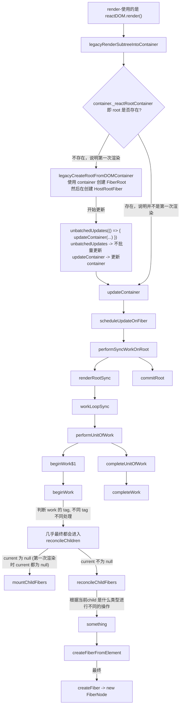

# beginWork

再讲 beginWork 之前先了解一下 react render 和 update

其实 render 与 update 差不太多，毕竟 render 也可以看作是第一次进行 update 嘛

具体的流程如下



解释上面的一些内容：

1. 上面所说的 root 并不是直接指 FiberRoot 而是 ReactDOMBlockingRoot 对象，大概是这样：`root = new ReactDOMBlockingRoot(...);` 然后 `root._internalRoot = FiberRoot` 无论是 legacy 还是 concurrent 模式 root 都是指 ReactDOMBlockingRoot (应该不是很重要，仅供了解)
2. FiberRoot 当前整个 React应用 的根基，每个 React应用 只能有一个 FiberRoot
3. HostRootFiber 假设当前的 render 是这样的 `ReactDOM.render(<Index />, root);` 那么 HostRootFiber 就是 `<Index />`
   的上层， `HostRootFiber.child = <index />`
4. 对于 FiberRoot 与 HostRootFiber 的关系:
    ```js
    // *双缓存策略，current Fiber树 被渲染在页面上
    FiberRoot.current = HostRootFiber;
    
    // *HostRootFiber 的 stateNode 指向 FiberRoot
    HostRootFiber.stateNode = FiberRoot;
    HostRootFiber.child = <index/>
    ```
5. 上面虽然有一个