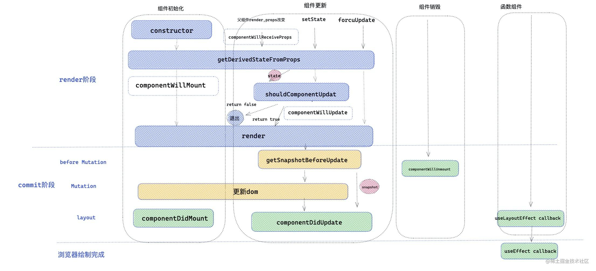
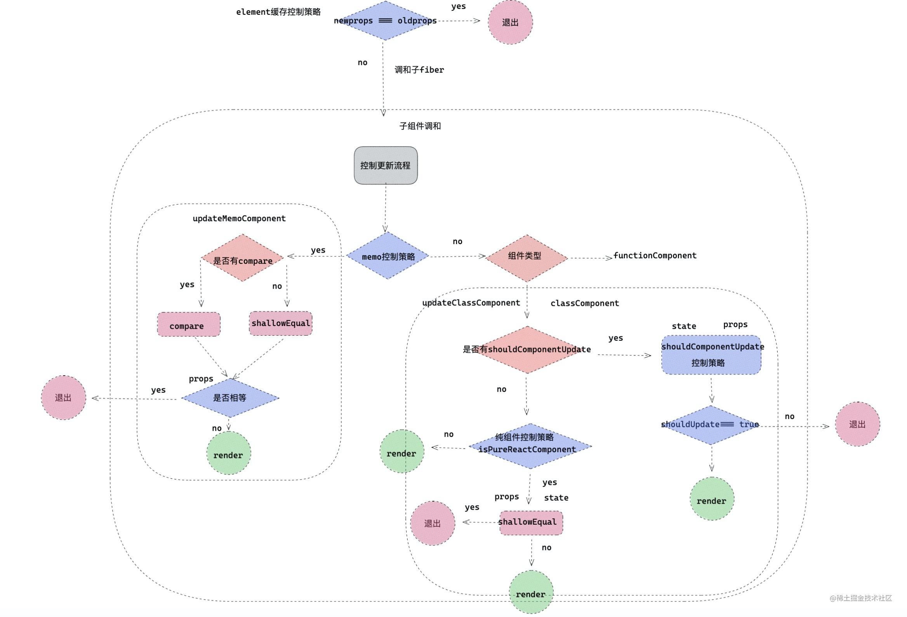

## ClassComponent 生命周期

生命周期的分析和图，具体看掘金小册，目前没时间放上来。

### 如何判断是否可以重新渲染

1. 判断当前是否是强制渲染状态，如果是强制渲染状态，那么将会重新渲染
2. 判断当前 instance 是否有 shouldComponentUpdate 函数，如果有就执行，并且返回返回值。
3. 判断当前是不是 pureComponent 如果是的话，对 props 和 state 进行浅比较
4. 上诉都不成立，就返回 true

