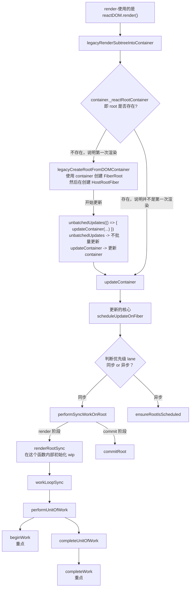
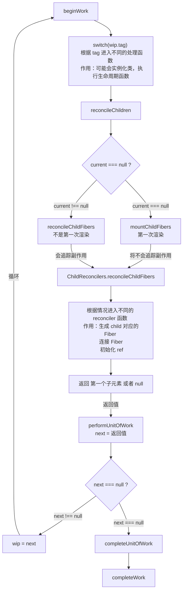
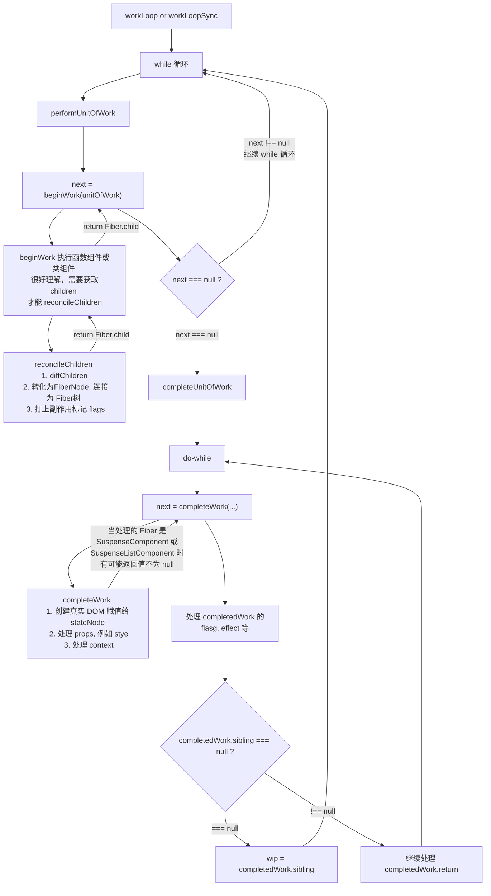

# beginWork & completeWork

还未解决的问题：

1. 当我点击按钮改变 state 时，进入 scheduleUpdateOnFiber 可是这样获得的 lane 依然是 SyncLane。那么什么情况下才会进入异步的更新呢？ 
2. 因为 lane 一直是 SyncLane 所以不清楚异步更新是否是在 ensureRootIsScheduled 中执行
3. 在 if(lane === SyncLane) 中会进行 context 的判断，需要理解 React Context 的具体含义
4. 需要理解 [Lane](src/react/v17/react-reconciler/src/ReactFiberLane.js) 的具体含义
5. effect 还不清楚

总体而言，就是对更新流程完全的不了解！！

## render or update

再讲 beginWork 之前先了解一下 react render 和 update

其实 render 与 update 差不太多，毕竟 render 也可以看作是第一次进行 update 嘛

具体的流程如下

还未完成：

1. 更新流程
2. commit 阶段



解释上面的一些内容：

1. 上面所说的 root 并不是直接指 FiberRoot 而是 ReactDOMBlockingRoot 对象，大概是这样：`root = new ReactDOMBlockingRoot(...);` 然后 `root._internalRoot = FiberRoot` 无论是 legacy 还是 concurrent 模式 root 都是指 `ReactDOMBlockingRoot` (应该不是很重要，仅供了解)
2. FiberRoot 当前整个 React应用 的根基，每个 React应用 只能有一个 FiberRoot
3. HostRootFiber 假设当前的 render 是这样的 `ReactDOM.render(<Index />, root);` 那么 HostRootFiber 就是 `<Index />`
   的上层， `HostRootFiber.child = <index />`
4. 对于 FiberRoot 与 HostRootFiber 的关系:
    ```js
    // *双缓存策略，current Fiber树 被渲染在页面上
    FiberRoot.current = HostRootFiber;
    
    // *HostRootFiber 的 stateNode 指向 FiberRoot
    HostRootFiber.stateNode = FiberRoot;
    HostRootFiber.child = <index/>
    ```
5. 上面虽然在 `legacyRenderSubtreeIntoContainer` 中会判断 root 是否存在，如果不存在的话，就直接调用 `updateContainer` 的代码。
   但是其实这并不是正常流程的更新，正常流程的更新一般直接走下面的 `scheduleUpdateOnFiber`。
   目前并不清楚什么情况下会走这里的判断。

## beginWork

beginWork 做的最重要的一件事情就是 `switch (wip.tag) {}` 判断 wip.tag 进入不同的处理函数。

1. `HostRootFiber` 将会进入 `updateHostRoot` 处理
2. `FunctionComponent` 将会进入 `updateFunctionComponent`
3. `ClassComponent` 将会进入 `updateClassComponent` 处理

这里它们内部具体的处理流程可以暂时忽略, 因为处理流程中参加了 context, lane 等很多处理，在尚不理解前可以忽略。

只需要知道一个大概就行了，在对 `ClassComponent` 的处理中，如果 `instance` 为 `null` 那么说明是第一次渲染，将会实例化 `ClassComponent`，并且执行相应的生命周期函数，比如在 render 之前的 `getDerivedStateFromProps`. 如果不为 `null` 那么将会执行更新操作。然后进入 `finishClassComponent` 调用实例的 render 获取 children 最后进入 `reconcileChildren` 并返回下一个需要进行的工作。

无论是第一次渲染，还是更新，都会进入 `reconcileChildren` 调和 `children`。函数内部通过检查 `current` 是否为 `null` 判断当前是 `mountChildFibers` 还是 `reconcileChildFibers`，其实这两个函数就是 `ChildReconciler` 传入不同的参数的返回值；至于不同的参数就是 `mountChildFibers` 将不会追踪副作用，`reconcileChildFibers` 将会追踪副作用。

**`ChildReconciler`** ，它本身是一个函数，函数内还声明了很多功能函数，返回的函数就是 `reconcileChildFibers`，所以上面那两个函数最终都会进入 `reconcileChildFibers` 。

`reconcileChildFibers` 内部同样会根据不同的情况进入不同的处理函数，总之大概的操作就是

1. 对于 mount 阶段，那么直接创建新 Fiber，并且与父节点，兄弟节点连接，生成 Fiber 树，某些情况下还会处理 ref。
2. 对于 update 阶段，就进行 diff 选择性复用 Fiber，并打上不同的副作用标记，在 commit 阶段中将会用到。

> 注意：连接兄弟节点 sibling 在 reconcileChildrenArray 中完成，因为只有 children 是一个数组时才有兄弟节点，才需要连接兄弟节点。 reconcileChildrenArray 在学习 diff 时已经学过了

到这里其实 beginWork 就执行完成了



## completeWork

什么时候执行 completeWork 呢？当 beginWork 的返回值为 null 时执行 completeUnitOfWork，然后 completeUnitOfWork 内部将会执行 completeWork

与 beginWork 类似，completeWork 也是第一时间 `switch(wip.tag) {}` 判断 wip.tag 进入不同的处理

completeWork 主要的内容：

1. 构建 真实DOM，并且遍历 childFiber 将子孙节点节点追加到 DOM 中
2. 处理 props，比如 className, style 处理等
3. 处理 context 

因为很多 React 组件的 stateNode 为 null 所以很多情况下 completeWork 并未做处理，而是直接返回 null, 比如 FunctionComponent, ForwardRef.

completeWork 处理处理完成后，就结束了，一般都是返回 null, 只有在 SuspenseListComponent 和 SuspenseComponent 某些情况下才不会返回 null。因为 beginWork 将会一直返回 child 也就是一直深入，completeWork 返回 null 就说明当前路线已经到底了，而 SuspenseComponent 配合 React.lazy 是不能直接获取到它的 child 的， completeWork 在处理 SuspenseComponent 时在某些情况下将不会返回 null，好让 SuspenseComponent 完成未完成的 beginWork。

completeWork 只负责处理 Fiber，那么遍历 Fiber 树和递归向上的操作是谁完成的呢？

那就是 completeUnitOfWork

---

completeUnitOfWork 主体是一个 do-while 循环。

completeUnitOfWork 主要的作用除了将当前的 unitOfWork 放到 completeWork 之外，还会处理 completedWork(完成的工作) 的副作用，将其连接成一条 循环链表，因为对 react 中的 effect, flags 概念还不熟悉，暂时跳过。

TODO effect flags

最后如果 completedWork 的 sibling 不为 null，那么就会让 wip = completedWork.sibling 然后直接返回，好进入 sibling 的 beginWork 中。

如果 completedWork 的 sibling 为 null 那么会接着处理 completedWork.return.

## 最后

构建 Fiber 树的过程其实就是一个深度优先遍历的过程。大致的流程如下所示

