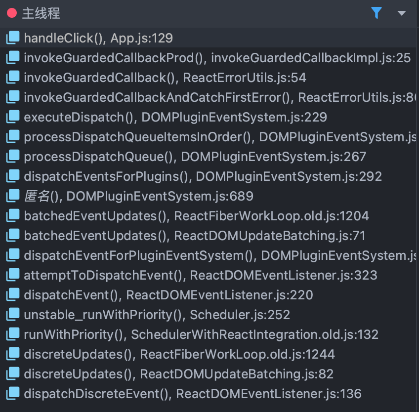
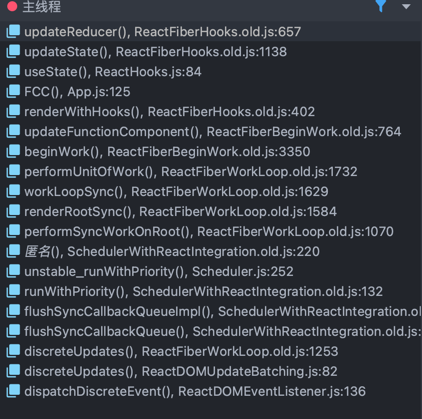
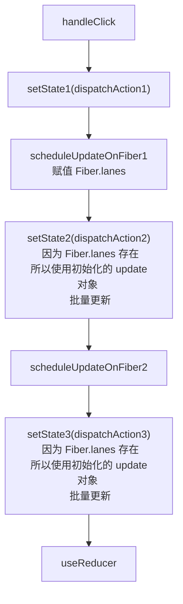
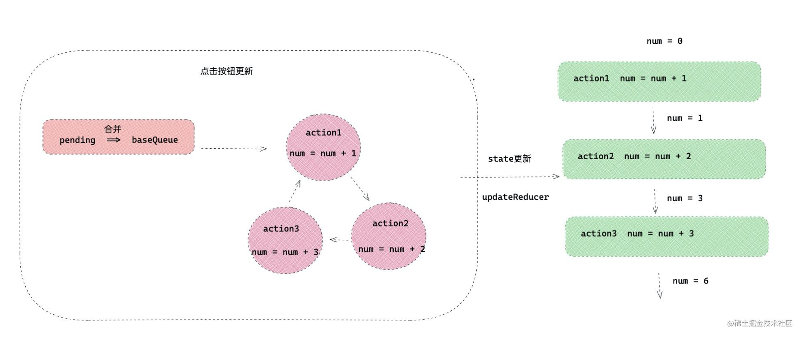
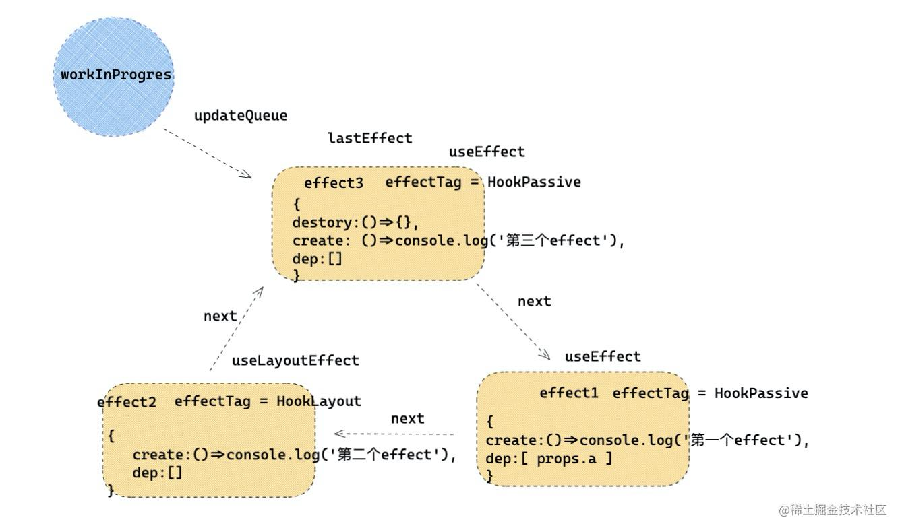
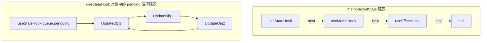

## [renderWithHooks](src/react/v17/react-reconciler/src/ReactFiberHooks.old.js)

函数组件一定会执行该函数，对理解 Hooks 非常重要

```flow js
// *精简了代码
export function renderWithHooks<Props, SecondArg>(
  current: Fiber | null,
  workInProgress: Fiber,
  Component: (p: Props, arg: SecondArg) => any,
  props: Props,
  secondArg: SecondArg,
  nextRenderLanes: Lanes
): any {
  renderLanes = nextRenderLanes;
  currentlyRenderingFiber = workInProgress;

  if (__DEV__) {
    hookTypesDev =
      current !== null
        ? ((current._debugHookTypes: any): Array<HookType>)
        : null;
    hookTypesUpdateIndexDev = -1;
    // Used for hot reloading:
    ignorePreviousDependencies =
      current !== null && current.type !== workInProgress.type;
  }

  // *重置对应的属性
  // *ClassCompoennt 中 memoizedState 用于存储 state 信息，对于 FC 用于存储 hooks 信息
  workInProgress.memoizedState = null;
  // *updateQueue 对于 FC 存放每个 useEffect/useLayoutEffect 产生的副作用组成的链表。在 commit 阶段更新这些副作用。
  workInProgress.updateQueue = null;
  workInProgress.lanes = NoLanes;

  // The following should have already been reset
  // currentHook = null;
  // workInProgressHook = null;

  // didScheduleRenderPhaseUpdate = false;

  // TODO Warn if no hooks are used at all during mount, then some are used during update.
  // Currently we will identify the update render as a mount because memoizedState === null.
  // This is tricky because it's valid for certain types of components (e.g. React.lazy)

  // Using memoizedState to differentiate between mount/update only works if at least one stateful hook is used.
  // Non-stateful hooks (e.g. context) don't get added to memoizedState,
  // so memoizedState would be null during updates and mounts.
  if (__DEV__) {
    if (current !== null && current.memoizedState !== null) {
      ReactCurrentDispatcher.current = HooksDispatcherOnUpdateInDEV;
    } else if (hookTypesDev !== null) {
      // This dispatcher handles an edge case where a component is updating,
      // but no stateful hooks have been used.
      // We want to match the production code behavior (which will use HooksDispatcherOnMount),
      // but with the extra DEV validation to ensure hooks ordering hasn't changed.
      // This dispatcher does that.
      ReactCurrentDispatcher.current = HooksDispatcherOnMountWithHookTypesInDEV;
    } else {
      ReactCurrentDispatcher.current = HooksDispatcherOnMountInDEV;
    }
  } else {
    // !针对于不同的时期(mount, update)执行的逻辑可能不一样, 所以 react 在这里判断当前是什么时期, 然后对 ReactCurrentDispatcher.current 进行赋值当前时期应当使用的 hooks 到时候直接调用 current 里面的 hooks 就可以了。
    // *具体什么什么时期调用什么 hooks 看下面的 ## hooks Dispatcher
    ReactCurrentDispatcher.current =
      current === null || current.memoizedState === null
        ? HooksDispatcherOnMount
        : HooksDispatcherOnUpdate;
  }

  // *在这里执行函数，同时也执行了 hooks 然后获取返回值
  // *有一个问题，hooks 都是从 react 中引入的，那么怎么还不同时期调用不同的 hooks 呢？ 具体看下面的 ## 根据不同时期获取不同的 hooks
  // *这里传入了第二个参数 seconedArg，这个参数其实就是 context，函数组件可以使用 FC.contextType = Context 来获取 context，并且可以直接从第二个参数中获取 context
  let children = Component(props, secondArg);

  // *检查是否有渲染阶段更新，这个涉及到 调度与调和 暂时跳过
  // Check if there was a render phase update
  if (didScheduleRenderPhaseUpdateDuringThisPass) {
    // ...
  }

  // *执行函数组件完成，又赋值为报错的 hooks
  // *在函数外调用 hooks 会报错就是因为这个
  ReactCurrentDispatcher.current = ContextOnlyDispatcher;

  if (__DEV__) {
    workInProgress._debugHookTypes = hookTypesDev;
  }

  // ...

  // *将 currentHook wipHook 重置为 null 这两个变量在 挂载 或 更新 hooks 都会用到
  currentHook = null;
  workInProgressHook = null;

  // ...

  return children;
}

```

## hooks Dispatcher

具体的 `mountState, updateState` 详见: `src/react/v17/react-reconciler/src/ReactFiberHooks.old.js`

```flow js
// *当hooks不是函数内部调用的时候，调用这个hooks对象下的hooks，所以报错
export const ContextOnlyDispatcher: Dispatcher = {
  readContext,
  ...,
  useState: throwInvalidHookError,// *所以全是 throw
  ...,
  useOpaqueIdentifier: throwInvalidHookError,
  unstable_isNewReconciler: enableNewReconciler,
};
// *挂载时用的 hooks
const HooksDispatcherOnMount: Dispatcher = {
  readContext,
  ...,
  useState: mountState,
  ...,
  useOpaqueIdentifier: mountOpaqueIdentifier,
  unstable_isNewReconciler: enableNewReconciler,
};
// *更新时用的 hooks
const HooksDispatcherOnUpdate: Dispatcher = {
  readContext,
  useState: updateState,
  ...,
  useOpaqueIdentifier: updateOpaqueIdentifier,
  unstable_isNewReconciler: enableNewReconciler,
};
// TODO 暂时还不清楚什么时候调用这个里面的 hooks
const HooksDispatcherOnRerender: Dispatcher = {
  readContext,
  useCallback: updateCallback,
  ...,
  useState: rerenderState,
  unstable_isNewReconciler: enableNewReconciler,
};
```

## 根据不同时期获取不同的 hooks

```flow js
// *这就是 react 中导出的 hooks
function useState<S>(
  initialState: (() => S) | S,
): [S, Dispatch<BasicStateAction<S>>] {
  // !这里是重点
  const dispatcher = resolveDispatcher();
  // *使用当前时期应该使用的 hooks
  return dispatcher.useState(initialState);
}

// *这里
function resolveDispatcher() {
  // *答案就是在这里，会通过 ReactCurrentDispatcher.current 这个全局属性进行获取.
  const dispatcher = ReactCurrentDispatcher.current;
  invariant(
    dispatcher !== null,
    'Invalid hook call. Hooks can only be called inside of the body of a function component. This could happen for' +
    ' one of the following reasons:\n' +
    '1. You might have mismatching versions of React and the renderer (such as React DOM)\n' +
    '2. You might be breaking the Rules of Hooks\n' +
    '3. You might have more than one copy of React in the same app\n' +
    'See https://reactjs.org/link/invalid-hook-call for tips about how to debug and fix this problem.',
  );
  // *然后进行返回
  return dispatcher;
}
```

## hooks 与 Fiber 建立联系

以挂载作为例子：mountState 会执行一个 mountWorkInProgressHook，这个函数会初始化一个 hook 的对象，然后把它挂载到当前 wip 的
Fiber.memoizedState 上。

```flow js
function mountState<S>(
  initialState: (() => S) | S,
): [S, Dispatch<BasicStateAction<S>>] {
  // !重点是这个
  const hook = mountWorkInProgressHook();
  // ...
}

// !mountWorkInProgressHook 将会初始化一个 hook 的存储空间，然后把它挂载到
function mountWorkInProgressHook(): Hook {
  const hook: Hook = {
    memoizedState: null,
    baseState: null,
    baseQueue: null,
    queue: null,
    next: null,
  };

  if (workInProgressHook === null) {
    // This is the first hook in the list
    // *workInProgressHook 是一个全局的属性，记录当前 wip 的组件的所有 hooks
    // *比如一个 FC 有很多个 hooks 第一次时 memoizedState 为空，所以直接赋值为 hook
    currentlyRenderingFiber.memoizedState = workInProgressHook = hook;
  } else {
    // Append to the end of the list
    // *第二次和后面的 hooks，workInProgressHook 有值，那就像下面这样赋值
    // !注意，memorizedState 是一个链表但并不是一个循环链表，末尾还是指向 null
    // !所以说 FC 的 memorizedState 应该是这样的 useStateHook -> useMemoHook -> useEffectHook -> null 假设顺序是这样的哦。一定注意不是循环链表。 
    workInProgressHook = workInProgressHook.next = hook;
  }
  // *返回 workInProgressHook 因为当前正在初始化 hooks 链表，比如现在执行到了 useState 所以此时的 wipHook 其实就是 useState 对应的 Hook 对象，把这个对象的引用返回，useState 接下来的操作就可以针对这个对象进行操作了。链表中完全都是按照顺序的，所以 Hook 对象中根本没有当前 hook 的唯一标识，单纯使用顺序来进行对应。
  // *简单点来说，就是构建 hooks 链表，mountWipHook 初始化当前 hook 对应的 Hook 对象，然后返回这个对象，由 hook 进行其他操作。
  // !链表使用顺序对应每一个 hook
  return workInProgressHook;
}
```

## 更新时的 Fiber.memoizedState 值

依然使用 useState 作为例子，当前时期执行的自然是 updateState

> 注意：解释了为什么 react 不允许在条件语句中执行 hook

```flow js
function updateState<S>(
  initialState: (() => S) | S,
): [S, Dispatch<BasicStateAction<S>>] {
  // *实际调用 useReducer
  return updateReducer(basicStateReducer, (initialState: any));
}

function updateReducer<S, I, A>(
  reducer: (S, A) => S,
  initialArg: I,
  init?: I => S,
): [S, Dispatch<A>] {
  // *updateWorkInProgressHook 详细见下面👇
  const hook = updateWorkInProgressHook();

  // ...
}

/**
 * !总结：
 * *如果看过上面的 mountWorkInProgressHook 就比较容易理解这里的 update 了, 其实做的事情本质上都是一致的
 * !更新 FC 时会重置 FC 对应的 Fiber.memoizedState 那么我们就需要重新对 memoizedState 进行赋值
 * !但是与 mount 不一样，mount 只需要进行初始化，但是 update 我们很可能会使用到之前的数据，状态，所以还需要复用之前的 hook
 * !所以在函数内部，使用 currentHook 指向旧的 hook
 * !然后最终也是构建 链表 并且返回 wipHook
 */
function updateWorkInProgressHook(): Hook {
  // *注意 renderWithHooks 在执行完 FC 后会重置 currentHook 和 wipHook

  let nextCurrentHook: null | Hook;
  // *currentHook 与 wipHook 对应 (详细请看 ## hooks 与 Fiber 建立联系 中的挂载 hook)
  // *与双渲染树有关，currentHook 当然存储的就是当前页面上的 Fiber 的 hook 链表

  // *currentlyRenderingFiber 其实就是当前正在渲染的 Fiber 其实就是 workInProgress

  /**
   * !因为 hook 是一个链表，存储在 memoizedState 上
   * !所以使用全局的 currentHook 应该指向当前节点的前一个，可以看作 prev
   * !第一个 if 就是在初始化 nextCurrentHook 指向当前的 hook 的位置。比如当前正在执行 useEffect 那么 nextCurrentHook 就应该指向 useEffect 在链表中的位置
   */
  if (currentHook === null) {
    const current = currentlyRenderingFiber.alternate;// *current 指向页面上的 Fiber
    if (current !== null) {
      nextCurrentHook = current.memoizedState;
    } else {
      nextCurrentHook = null;
    }
  } else {
    nextCurrentHook = currentHook.next;
  }

  /**
   * *首先知道 currentlyRenderingFiber 就是当前的 wip
   * *wip.memoizedState 在执行 FC 前 renderWithHooks 中将会被清空
   * *workInProgressHook 与 currentHook 对应, 记录当前 wip 的 hooks 链表的 prev
   *
   * !这个 if 需要与接下来一个 if 搭配看
   * !这个函数的作用就是构建 wip.memoizedState 链表，并且这个链表是按照 FC 中 hooks 的顺序的，是有序的，那么就需要按照顺序在末尾添加节点
   * !nextWorkInProgressHook 的作用就像是指向链表的末尾，然后要保证 末尾为 null，这样才不会从中间进行插入。
   */
  let nextWorkInProgressHook: null | Hook;
  if (workInProgressHook === null) {// *workInProgressHook 为空，说明此时链表都为空
    nextWorkInProgressHook = currentlyRenderingFiber.memoizedState;// *同样的 renderWithHooks 会清空 wip.memoizedState
  } else {
    // *链表存在就指向 next
    nextWorkInProgressHook = workInProgressHook.next;
  }

  // *如果不是末尾的化执行 if，这个情况应该很少，不清楚什么情况下执行这个 if 可以忽略。
  if (nextWorkInProgressHook !== null) {
    // There's already a work-in-progress. Reuse it.
    workInProgressHook = nextWorkInProgressHook;// prev 前进
    nextWorkInProgressHook = workInProgressHook.next;

    // *prevNode = nextNode 移动到末尾
    currentHook = nextCurrentHook;
  } else {
    // Clone from the current hook.

    invariant(
      nextCurrentHook !== null,
      'Rendered more hooks than during the previous render.',
    );
    // *prevNode = nextNode 移动到末尾
    currentHook = nextCurrentHook;

    // !这里就解释了为什么 hooks 不能放在条件语句中执行，因为需要复用之前的一些属性，如果放在条件语句中，两次的 hooks 链表都不能保证长度一致，顺序一致，哪还有什么用？
    // 初始化 Hook 对象，并且重用了之前的一些属性
    const newHook: Hook = {
      memoizedState: currentHook.memoizedState,

      baseState: currentHook.baseState,
      baseQueue: currentHook.baseQueue,
      queue: currentHook.queue,

      next: null,
    };

    // *与 mount 一样， 连接链表赋值给 wip.memoizedState
    if (workInProgressHook === null) {
      // This is the first hook in the list.
      currentlyRenderingFiber.memoizedState = workInProgressHook = newHook;
    } else {
      // Append to the end of the list.
      workInProgressHook = workInProgressHook.next = newHook;
    }
  }
  return workInProgressHook;
}
```

## useState 原理

测试用例为：

```jsx
function CC() {
  const [count, setCount] = useState(0);

  const handleClick = useMemo(() => {
    return () => {
      // *下面依然称为 setState
      setCount((prev) => prev + 1);
      setCount((prev) => prev + 1);
      setCount((prev) => prev + 1);
    };
  }, []);

  return (
    <div onClick={handleClick}>
      this is CC function component,{" "}
      <span style={{ color: "red" }}>{count}</span>
    </div>
  );
}
```

### 挂载时

```flow js
function mountState<S>(
  initialState: (() => S) | S,
): [S, Dispatch<BasicStateAction<S>>] {
  // *上面已经讲了
  const hook = mountWorkInProgressHook();

  if (typeof initialState === 'function') {
    // $FlowFixMe: Flow doesn't like mixed types
    initialState = initialState();// *如果是函数就执行函数，获取返回值作为 初始值
  }
  hook.memoizedState = hook.baseState = initialState;
  const queue = (hook.queue = {// *负责记录更新的各种状态
    pending: null,
    dispatch: null,
    lastRenderedReducer: basicStateReducer,// *全局函数, useState 其实就是简化版的 useReducer 所以两者的 queue 节点格式一致，属性不一样而已
    lastRenderedState: (initialState: any),
  });
  // *dispatch 也就是 setState 其实就是 dispatchAction
  const dispatch: Dispatch<BasicStateAction<S>,
    > = (queue.dispatch = (dispatchAction.bind(
    null,
    currentlyRenderingFiber,
    queue,
  ): any));
  // *useReducer 也是这样进行返回的
  // *所以调用 useState 其实就是调用 dispatchAction
  return [hook.memoizedState, dispatch];
}
```

### 更新时

[上面](#挂载时)说了，调用 useState 其实就是调用 dispatchAction

```flow js
// !注意，fiber 和 queue 早在 mount 时，就 bind 给 dispatchAction 了所以并不需要 useState 时传入。
function dispatchAction<S, A>(
  fiber: Fiber,
  queue: UpdateQueue<S, A>,
  action: A
) {
  // ...

  // *调度相关，可以暂时忽略
  const eventTime = requestEventTime();
  const lane = requestUpdateLane(fiber);// *请求更新时的 lane 在 ReactFiberLane 文件夹

  // *创建一个 update 对象
  const update: Update<S, A> = {
    lane,
    action,
    eagerReducer: null,
    eagerState: null,
    next: (null: any),
  };
  
  // !memorizedState 不是循环链表，但是 queue 是循环链表
  // Append the update to the end of the list.
  const pending = queue.pending;// *待更新任务链表
  if (pending === null) {// *开始构建链表
    // This is the first update. Create a circular list.
    update.next = update;// TODO 循环链表，react 很多地方使用了循环链表，effect 链表也是，暂时不知道为什么，可能就不需要记录头和尾
  } else {// *如果已有 待更新任务。
    // *这里依然构建了一个循环链表，具体的链表结构看下面。
    update.next = pending.next;
    pending.next = update;
  }
  // *例如 原先有两个节点 u1 -> u2 -> u1 此时添加 u3 后： u3 -> u1 -> u2 -> u3. 此时的 pending 就会指向 u3
  // *所以，我们使用 pending 时，就会知道当前指向的是 tail 节点，只需要 pending.next 就是 头节点了。
  queue.pending = update;// 赋值给 pending

  const alternate = fiber.alternate;
  if (
    fiber === currentlyRenderingFiber ||
    (alternate !== null && alternate === currentlyRenderingFiber)
  ) {
    // *如果当前正在 rendering 或者说正在进行 调度调和任务 那么只修改下面对应的变量，不进行 dispatchAction 操作。
    didScheduleRenderPhaseUpdateDuringThisPass =
      didScheduleRenderPhaseUpdate = true;
  } else {
     // *fiber.lanes 默认是为 NoLanes 的，但是在 markUpdateLaneFromFiberToRoot 中，将会对 fiber.lanes 赋值
    if (
      fiber.lanes === NoLanes &&// 那么这里就是 fiber 还没有待处理的更新时
      (alternate === null || alternate.lanes === NoLanes)
    ) {
       // *进入这个 if 就说明「当前 fiber 不会引起调度调和等操作」，因为 lanes 都为 NoLanes，所以我们就需要在这里计算值，如果与之前的值相同，那么我们就可以直接返回，从而跳过 scheduleUpdateOnFiber，算是一种优化。
       // *只要有一个 Update 需要调度，那么后续的 Update 都不会进入这个 if，直接进入 scheduleUpdateOnFiber
       // !但是也要进行注意，因为这个 Update 确实放到了 queue.pending 里面，这些 update 将会在 updateReducer 时进行处理。
      const lastRenderedReducer = queue.lastRenderedReducer;
      if (lastRenderedReducer !== null) {
        let prevDispatcher;

        try {
          const currentState: S = (queue.lastRenderedState: any); // *上次的 state
          const eagerState = lastRenderedReducer(currentState, action);// *计算这次的 state
          // *根据这里的 注释，如果我们进入渲染阶段时， reducer 没有进行改变，那么就可以直接使用 eagerState，所以并不是一定使用 eagerState 的。 
          // Stash the eagerly computed state, and the reducer used to compute
          // it, on the update object. If the reducer hasn't changed by the
          // time we enter the render phase, then the eager state can be used
          // without calling the reducer again.
          // *存储在 update 上
          update.eagerReducer = lastRenderedReducer;
          update.eagerState = eagerState;
          // *如果前后两次的值一样，那么就直接返回，节约性能
          if (is(eagerState, currentState)) {
            return;
          }
        } catch (error) {
          // Suppress the error. It will throw again in the render phase.
        } finally {
          if (__DEV__) {
            ReactCurrentDispatcher.current = prevDispatcher;
          }
        }
      }
    }
    // *进行调度更新
    scheduleUpdateOnFiber(fiber, lane, eventTime);
  }

  // ...
}
```





在 dispatchAction 的最后，会执行 scheduleUpdateOnFiber 但是并不会直接进入调度更新，通过上面的截图可以看出来，进入 useReducer 时，调用栈里面并没有 updateReducer，具体的内容应该在 **调度部分** 了。

> 注意：所以真正的流程是，每次执行 useState 然后触发 mountState | updateState，返回出现在的 state

在更新阶段执行的 useState 自然就是 updateState 了(本质上执行 updateReducer)。

```flow js
function updateState<S>(
  initialState: (() => S) | S,
): [S, Dispatch<BasicStateAction<S>>] {
  // *实际调用 useReducer
  return updateReducer(basicStateReducer, (initialState: any));
}

// !总结：updateReducer 做的事情，其实就是把 update 链表拿出来，然后循环执行 reducer，获取 eagerState，然后与 prev 进行比对，最后返回新的 [state, setState];
function updateReducer<S, I, A>(
    reducer: (S, A) => S,
    initialArg: I,
    init?: (I) => S
): [S, Dispatch<A>] {
  // *updateWorkInProgressHook 详细见下面👇
  const hook = updateWorkInProgressHook();
  const queue = hook.queue;
  invariant(
    queue !== null,
    'Should have a queue. This is likely a bug in React. Please file an issue.',
  );

   queue.lastRenderedReducer = reducer;

   const current: Hook = (currentHook: any);

   // The last rebase update that is NOT part of the base state.
   let baseQueue = current.baseQueue;

   // The last pending update that hasn't been processed yet.
   const pendingQueue = queue.pending;
   if (pendingQueue !== null) {
      // We have new updates that haven't been processed yet.
      // We'll add them to the base queue.
      // *如果这里的 baseQueue 有值，那么说明还有未处理的更新
      if (baseQueue !== null) {
         // Merge the pending queue and the base queue.
         // *将 pendingQueue 放到 baseQueue 的末尾
         const baseFirst = baseQueue.next;
         const pendingFirst = pendingQueue.next;
         baseQueue.next = pendingFirst;
         pendingQueue.next = baseFirst;
      }
      if (__DEV__) {
         if (current.baseQueue !== baseQueue) {
            // Internal invariant that should never happen, but feasibly could in
            // the future if we implement resuming, or some form of that.
            console.error(
                "Internal error: Expected work-in-progress queue to be a clone. " +
                "This is a bug in React."
            );
         }
      }
      // *最终 baseQueue 指向 pendingQueue，也就是 循环链表 的末尾
      current.baseQueue = baseQueue = pendingQueue;
      queue.pending = null;
   }

   // *开始根据 Update 进行更新
   if (baseQueue !== null) {
      // We have a queue to process.
      const first = baseQueue.next;
      let newState = current.baseState;

      let newBaseState = null;
      let newBaseQueueFirst = null;
      let newBaseQueueLast = null;
      // *指向第一个 Update 对象
      let update = first;
      do {
         const updateLane = update.lane;
         // *检查 renderLanes 中是否不包含 updateLane
         // *如果不包含的话，就会跳过此次更新
         if (!isSubsetOfLanes(renderLanes, updateLane)) {
            // Priority is insufficient. Skip this update. If this is the first
            // skipped update, the previous update/state is the new base
            // update/state.
            const clone: Update<S, A> = {
               lane: updateLane,
               action: update.action,
               eagerReducer: update.eagerReducer,
               eagerState: update.eagerState,
               next: (null: any),
            };
            // *跳过更新时，就会对 newBaseQueueLast 赋值，变成一个新的循环链表
            if (newBaseQueueLast === null) {
               newBaseQueueFirst = newBaseQueueLast = clone;
               newBaseState = newState;
            } else {
               newBaseQueueLast = newBaseQueueLast.next = clone;
            }
            // Update the remaining priority in the queue.
            // TODO: Don't need to accumulate this. Instead, we can remove
            // renderLanes from the original lanes.
            currentlyRenderingFiber.lanes = mergeLanes(
                currentlyRenderingFiber.lanes,
                updateLane
            );
            markSkippedUpdateLanes(updateLane);
         } else {
            // This update does have sufficient priority.

            // *如果之前的循环中有需要跳过的更新，那么后面的所有更新全部跳过，所以这里判断 newBaseQueueLast 不是 null 就全部放到 newBaseQueueLast中去
            if (newBaseQueueLast !== null) {
               const clone: Update<S, A> = {
                  // This update is going to be committed so we never want uncommit
                  // it. Using NoLane works because 0 is a subset of all bitmasks, so
                  // this will never be skipped by the check above.
                  lane: NoLane,
                  action: update.action,
                  eagerReducer: update.eagerReducer,
                  eagerState: update.eagerState,
                  next: (null: any),
               };
               newBaseQueueLast = newBaseQueueLast.next = clone;
            }

            // Process this update.
            // *如果存储的 reducer 与 初始 reducer 一致，那么直接返回 newState
            if (update.eagerReducer === reducer) {
               // If this update was processed eagerly, and its reducer matches the
               // current reducer, we can use the eagerly computed state.
               newState = ((update.eagerState: any): S);
            } else {
               const action = update.action;
               newState = reducer(newState, action);
            }
         }
         update = update.next;
      } while (update !== null && update !== first);

      // *如果没有跳过的更新，那么就可以直接对 newBaseState 赋值
      if (newBaseQueueLast === null) {
         newBaseState = newState;
      } else {
         newBaseQueueLast.next = (newBaseQueueFirst: any);
      }

      // Mark that the fiber performed work, but only if the new state is
      // different from the current state.
      // *如果两者不一样，那么说明需要进行重新渲染，标记 wip 收到了更新，后续的调和 children 时就不会直接复用
      if (!is(newState, hook.memoizedState)) {
         markWorkInProgressReceivedUpdate();
      }

      // *对 Hook 对象的值进行修改
      hook.memoizedState = newState;
      hook.baseState = newBaseState;
      hook.baseQueue = newBaseQueueLast;

      queue.lastRenderedState = newState;
   }

   const dispatch: Dispatch<A> = (queue.dispatch: any);
   // *进行返回。
   return [hook.memoizedState, dispatch];
}
```

上面的例子，经过实测，执行的顺序是这样的

1. 触发点击事件，进入点击事件处理函数。
2. 进入 setState 也就是 dispatchAction 构建 update 链表，然后执行函数，获取 eagerState，并且都放到 update 对象中去。然后调用
   scheduleUpdateOnFiber
3. 不要忘记 dispatchAction 函数中请求的 lane，在 scheduleUpdateOnFiber 函数中，将会将这个 lane 合并传递给当前的
   Fiber，scheduleUpdateOnFiber 其他的部分没有深入研究。
4. 因为 Fiber.lanes 有值了，相当于说明已经为其分配优先级了。
5. 所以在执行完 setState 后，进入第二个 setState(dispatchAction) 时，会发现 Fiber.lanes 有值，就不会进入获取 eagerState
   的代码，而是 update 链表连接完成后，就直接使用当前的空 update 对象。第三个 setState(dispatchAction) 也是一样的；这就是批量更新了，所以批量更新可能与 lane 有关。
6. 事件处理函数执行完成，经过了还不清楚的代码后，就进入 useReducer 进行更新了。





## useEffect 原理

### 挂载时

```flow js
function mountEffect(
  create: () => (() => void) | void,
  deps: Array<mixed> | void | null
): void {
  // ...
  // 实际执行 mountEffectImpl
  // *useLayoutEffect 实际执行也是 mountEffectImpl
  // *useLayoutEffect 传入的参数不同，第一个和第二个参数分别为： UpdateEffect, HookLayout
  return mountEffectImpl(
    // PassiveEffect 其实就是 Passive 标记使用了 useEffect 的函数组件
    UpdateEffect | PassiveEffect,// *这个参数是 fiberFlags 用于标记 fiber 的副作用。
    HookPassive,// *这个参数是 hookFlags 用于指明当前是哪个 hook 比如 layout 是 useLayoutEffect, passive 指的是 useEffect
    create,// 传入的函数
    deps
  );
}

function mountEffectImpl(fiberFlags, hookFlags, create, deps): void {
  // *这个上面说过，用于创建 Hook 对象，连接 hooks 链表。
  const hook = mountWorkInProgressHook();
  const nextDeps = deps === undefined ? null : deps;
  // 这里有所不一样了，这里会对 wip.flags 赋值, 指定目前 fiber 的副作用
  // TODO flag 就是副作用，源文件位于 ReactFiberFlag，在 commit 阶段，react 会统一处理这些副作用，比如 DOM 操作等等，在 reconcileChildren 哪里也看到过，目前还不熟悉
  currentlyRenderingFiber.flags |= fiberFlags;
  // *这里 memoizedState 的值其实就是一个 effect 对象，pushEffect 将会返回一个 effect 对象
  hook.memoizedState = pushEffect(
    HookHasEffect | hookFlags,
    create,
    undefined,
    nextDeps
  );
}

// *总结：pushEffect 的作用就是 
// 1 创建一个 Effect 对象
// 2 放到 wip 的 updateQueue 链表中去
// 3 返回这个 Effect 对象
function pushEffect(tag, create, destroy, deps) {
  // 创建一个 Effect 对象
  const effect: Effect = {
    tag,
    create,
    destroy,
    deps,
    // Circular
    next: (null: any),
  };
  // *获取 wip 的 updateQueue
  let componentUpdateQueue: null | FunctionComponentUpdateQueue =
    (currentlyRenderingFiber.updateQueue: any);
  // *这里其实是熟悉的操作了，之前就说过 effect 也是一个链表，并且也是一个循环链表
  // *所以这里的操作就是，updateQueue 为空时，进行初始化；不为空时，将当前的 Effect 对象放到链表中。
  if (componentUpdateQueue === null) {
    componentUpdateQueue = createFunctionComponentUpdateQueue();
    currentlyRenderingFiber.updateQueue = (componentUpdateQueue: any);
    componentUpdateQueue.lastEffect = effect.next = effect;
  } else {
    const lastEffect = componentUpdateQueue.lastEffect;
    if (lastEffect === null) {
      componentUpdateQueue.lastEffect = effect.next = effect;
    } else {
      const firstEffect = lastEffect.next;
      lastEffect.next = effect;
      effect.next = firstEffect;
      componentUpdateQueue.lastEffect = effect;
    }
  }
  // *返回创建的 effect
  return effect;
}
```

```jsx
React.useEffect(()=>{
    console.log('第一个effect')
},[ props.a ])
React.useLayoutEffect(()=>{
    console.log('第二个effect')
},[])
React.useEffect(()=>{
    console.log('第三个effect')
    return () => {}
},[])
```

上面的 jsx 在 updateQueue 中会变成这样。



> 副作用何时调用？

useEffect 中的副作用，也就是传入的函数，并不会在 commit 阶段执行，因为此时函数组件并未被挂载到 dom 中。

副作用其实会被「异步调用」，也就是「调度」中学到的 [performWorkUntilDeadline](src/react/v17/scheduler/src/forks/SchedulerHostConfig.default.js) 函数中执行回调，然后经过一系列的函数嵌套，最终进入 [flushPassiveEffectsImpl](src/react/v17/react-reconciler/src/ReactFiberWorkLoop.old.js) 。在这个函数中，将会真正执行副作用函数。

调用副作用函数的同时，会接收副作用函数的返回值，并且赋值给 effect 对象的 destroy 属性。也就是函数组件卸载时将会执行的函数。

还有一点，这一轮中，需要调用的所有的 副作用函数 其实是一个数组，格式是 [effect1, effect1Fiber, effect2, effect2Fiber] 前一个是 effect 对象，后面的就是它的 fiber。然后使用一个 for 循环，每次循环 index+=2；

因为通过 for 循环执行副作用，那么就说明了，所有的 副作用函数，将会同步，按照顺序执行。执行的顺序是：「由内向外」

> destroy 何时调用？

destroy 其实也是在 flushPassiveEffectsImpl 函数中调用的；并且，会先调用 destroy 函数后，再执行**副作用函数**

### 更新时

更新时，自然执行 updateEffect

```flow js
function updateEffect(
  create: () => (() => void) | void,
  deps: Array<mixed> | void | null
): void {
  // *与 mountEffect 类似，实际执行 updateEffectImpl
  // *useLayoutEffect 传入的第 1，2 个参数为：UpdateEffect, HookLayout
  return updateEffectImpl(
    UpdateEffect | PassiveEffect,
    HookPassive,
    create,
    deps
  );
}

// *fiberFlags 用于定义 fiber 的副作用
// *hooksFlags 用于区分 useLayoutEffect 还是 useEffect 
function updateEffectImpl(fiberFlags, hookFlags, create, deps): void {
  // 上面讲过，连接 hooks 链表，并且返回当前 hook 对应的 Hook 对象。
  const hook = updateWorkInProgressHook();
  const nextDeps = deps === undefined ? null : deps;
  let destroy = undefined;

  // *正常情况下 currenHook 都不会为 null。
  if (currentHook !== null) {
    // *上一次的 Effect 对象
    const prevEffect = currentHook.memoizedState;
    destroy = prevEffect.destroy;
    if (nextDeps !== null) {
      const prevDeps = prevEffect.deps;
      // *比较前后 deps 是否一样
      if (areHookInputsEqual(nextDeps, prevDeps)) {
        // *如果一样的话，就直接返回。
        // *返回之前依然需要创建 Effect 对象，并且放到 updateQueue 里面去，所以无论是否执行副作用，updateQueue 链表都是有所有的 useEffect 的 Effect 对象。
        // !但是注意，这里的第一个参数没有 HookHasEffect 说明不回去执行这个副作用。
        pushEffect(hookFlags, create, destroy, nextDeps);
        return;
      }
    }
  }

  // *deps 不一样的话，就会对 wip.flags 赋值。
  currentlyRenderingFiber.flags |= fiberFlags;

  // pushEffect 上面讲过，将 Effect 对象放到 updateQueue
  // *这里有 HookHasEffect
  hook.memoizedState = pushEffect(
    HookHasEffect | hookFlags,
    create,
    destroy,
    nextDeps
  );
}

// *看一下比较 deps 的逻辑
function areHookInputsEqual(
  nextDeps: Array<mixed>,
  prevDeps: Array<mixed> | null
) {

  // *deps 为 null 直接返回 false 每次都需要执行 useEffect
  if (prevDeps === null) {
    return false;
  }

  for (let i = 0; i < prevDeps.length && i < nextDeps.length; i++) {
    // *这个 is 基本上就是 Object.is
    // *Object.is 基本上等于 === 三等于符号
    // 但是 Object.is(+0, -0) 结果是 false；+0 === -0 结果是 true
    // Object.is(NaN, NaN) 结果是 true, NaN === NaN 结果是 false
    if (is(nextDeps[i], prevDeps[i])) {
      continue;
    }
    return false;
  }
  return true;
}
```

> 注意：useEffect 的 deps 传递的是值，所以比较的是值。

> 注意：Effect.destroy 并不是在执行 useEffect 时获得的，而是在 commit 阶段，执行副作用时，将会执行回调函数，这个时候才获得 destroy 并且赋值给 Effect。

## useRef 原理

useRef 非常简单, 就是每次找到对应的 Hook 对象，然后返回其 memoizedState 值就可以了。

```flow js
function mountRef<T>(initialValue: T): {| current: T |} {
  const hook = mountWorkInProgressHook();
  const ref = { current: initialValue };
  hook.memoizedState = ref;
  return ref;
}

function updateRef<T>(initialValue: T): {| current: T |} {
  const hook = updateWorkInProgressHook();
  return hook.memoizedState;
}
```

## useMemo 原理

useMemo 原理，相对于 useState, useEffect 来说也很简单

```flow js
function mountMemo<T>(
  nextCreate: () => T,
  deps: Array<mixed> | void | null
): T {
  const hook = mountWorkInProgressHook();
  const nextDeps = deps === undefined ? null : deps;
  // *执行函数，获取值
  const nextValue = nextCreate();
  // useMemo 的 memoizedState 记录的是一个数组，值 和 deps 
  hook.memoizedState = [nextValue, nextDeps];
  return nextValue;
}

function updateMemo<T>(
  nextCreate: () => T,
  deps: Array<mixed> | void | null
): T {
  const hook = updateWorkInProgressHook();
  const nextDeps = deps === undefined ? null : deps;
  const prevState = hook.memoizedState;
  // *在 useEffect 中见到过，比较 deps
  if (prevState !== null) {
    // Assume these are defined. If they're not, areHookInputsEqual will warn.
    if (nextDeps !== null) {
      const prevDeps: Array<mixed> | null = prevState[1];
      if (areHookInputsEqual(nextDeps, prevDeps)) {
        // *如果 deps 相同，那么就直接返回值，不用修改 Hook 对象
        return prevState[0];
      }
    }
  }
  // 获取新值
  const nextValue = nextCreate();
  // *修改 Hook 对象。
  hook.memoizedState = [nextValue, nextDeps];
  return nextValue;
}
```

## 注意

> 1. FC 的 memorizedState 不是循环链表，它是 Hook 对象的单向链表，假设一个 FC 的 Hooks 顺序为：useState -> useMemo -> useEffect 那么它的 memorizedState 是 useStateHook -> useMemoHook -> useEffectHook
> 2. Hook 对象存储了当前 Hook 的基本信息，比如 useState 的 Hook 对象就会存储 baseState 等；classComponent 的 memorizedState 是一个对象不是链表，它直接有一个 baseState 属性进行存储。
> 3. memorizedState 是一个单向链表，但是 Hook 对象的 pending 却是循环链表，对于 useState 的批量更新，就会先形成循环链表放到 pending 中；classComponent 的 setState 将会直接创建 Update 对象，并且放到 updateQueue 循环链表中去，FC 的 useEffect 也会直接使用 updateQueue。 这样感觉 类组件的 setState 反而与 函数组件 的 useEffect 更像了。

