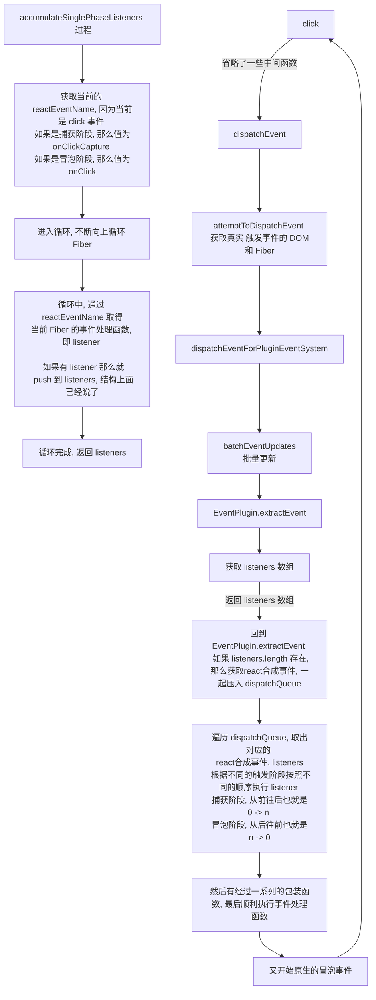

## 事件系统

react v17

### 事件绑定

根据 [概览](../../事件系统/概览.md) 可知，事件绑定在函数 [setInitialDOMProperties](src/react/v17/react-dom/src/client/ReactDOMComponent.js)

> setInitialDOMProperties 将在 complete 阶段执行， 

```js
function setInitialDOMProperties(
  tag: string,
  domElement: Element,
  rootContainerElement: Element | Document,
  nextProps: Object,
  isCustomComponentTag: boolean
): void {
  // *遍历 props
  for (const propKey in nextProps) {
    if (!nextProps.hasOwnProperty(propKey)) { continue; }
    const nextProp = nextProps[propKey];
    if (...) { ... }
    // *registrationNameDependencies 包含 react 支持的所有的事件，如果当前的 propKey 是 react支持的事件就进入该 if
    else if (registrationNameDependencies.hasOwnProperty(propKey)) {
      if (nextProp != null) {
        // !注意，这里与 react v16 有所不同，v16 这里直接执行 ensureListeningTo 函数，但是 v17 这里不会执行。因为 enableEagerRootListeners 是一个常量，值一直为 true，if (false) 自然不会执行，并且在 react-dom.development.js 中直接没有这个 if，只剩下 onScroll 的判断。这样更能说明问题了
        if (!enableEagerRootListeners) {
          // *忽略这个函数，并没有执行
          ensureListeningTo(rootContainerElement, propKey, domElement);
        } else if (propKey === 'onScroll') {
          listenToNonDelegatedEvent('scroll', domElement);
        }
      }
    } else if (nextProp != null) {
      setValueForProperty(domElement, propKey, nextProp, isCustomComponentTag);
    }
  }
}
```

那么在 react v17 中遍历到 onClick 这种事件的时候貌似并没有做什么。那么事件绑定是什么时候绑定的呢？其实在最开始的 `createRootImpl` 也就是创建 `HostRootFiber` 时就通过 `listenToAllSupportedEvents` 将所有支持的事件都绑定到了 `rootContainerElement` (这里也对应了 react v17 就将事件统统绑定到 rootContainer 而不是 document)

> 注意：input, change 事件也是直接绑定到了 rootContainer 上，并且也是有效的。

那么事件处理函数又是多久绑定的呢？

通过对绑定的事件处理函数进行 debugger 可以发现，**其实根本没有将事件处理函数直接绑定到 rootContainerElement 上**，而是直接使用的上面 `listenToAllSupportedEvents` 中绑定的事件。大概的流程为：

1. `listenToAllSupportedEvents` 为 `rootContainerElement` 绑定所有的事件
2. 点击子组件，其实就相当于在点击 `rootContainerElement` 所以会触发对应的点击事件。
3. 绑定事件的时候会根据[事件优先级](../../前置知识/React中的优先级.md)(通过 `getEventPriorityForPluginSystem` 函数获取优先级)创建且绑定不同的处理函数，但是最终其实都是执行 [dispatchEvent](/src/react/v17/react-dom/src/events/ReactDOMEventListener.js)
4. `dispatchEvent` 内部将将进入其他函数，获取触发事件的元素，然后根据对应的 Fiber 然后在根据很多层函数，最终执行事件处理函数。

通过优先级创建 listener 的函数，大致可以分为三种优先级的 listener，与上面的第 3 点呼应。

```flow js
export function createEventListenerWrapperWithPriority(
  targetContainer: EventTarget,
  domEventName: DOMEventName,
  eventSystemFlags: EventSystemFlags,
): Function {
  const eventPriority = getEventPriorityForPluginSystem(domEventName);
  let listenerWrapper;
  switch (eventPriority) {
    case DiscreteEvent:
      listenerWrapper = dispatchDiscreteEvent;
      break;
    case UserBlockingEvent:
      listenerWrapper = dispatchUserBlockingUpdate;
      break;
    case ContinuousEvent:
    default:
      listenerWrapper = dispatchEvent;
      break;
  }
  return listenerWrapper.bind(
    null,
    domEventName,
    eventSystemFlags,
    targetContainer,
  );
}
```

### 事件触发

使用的案例

```jsx
import React from 'react'
import './index.css'
class EventDemo extends React.Component{
  state = {
    count: 0,
  }

  onDemoClick = e => {this.setState({ count: this.state.count + 1 })}
  onParentClick = () => {console.log('父级元素的点击事件被触发了');}
  onParentClickCapture = () => {console.log('父级元素捕获到点击事件');}
  onSubCounterClick = () => {console.log('子元素点击事件');}
  onSubCounterClickCapture = () => {console.log('子元素点击事件 capture')}
  
  render() {
    const { count } = this.state
    return <div className={'counter-parent'} onClick={this.onParentClick} onClickCapture={this.onParentClickCapture}>
      counter-parent
      <div onClick={this.onDemoClick} className={'counter'}>
        counter：{count}
        <div className={'sub-counter'} onClick={this.onSubCounterClick} onClickCapture={this.onSubCounterClickCapture}>
          子组件
        </div>
      </div>
    </div>
  }
}

export default EventDemo

```

1. 点击子元素后，自然会执行 dispatchEvent
2. 然后会进入 [attemptToDispatchEvent](src/react/v17/react-dom/src/events/ReactDOMEventListener.js) 
   （如果没有正在进行的事件？因为在进入 attemptToDispatchEvent 之前会进行 hasQueuedDiscreteEvents
      hasQueuedDiscreteEvents 判断 具体可以看 dispatchEvent）
   然后在 `attemptToDispatchEvent` 中会通过原生的事件参数(event)获取到触发事件的 DOM，然后通过该 DOM 获取到对应的 Fiber
   然后正常情况下会进入 [dispatchEventForPluginEventSystem](src/react/v17/react-dom/src/events/DOMPluginEventSystem.js).
3. `dispatchEventForPluginEventSystem` 一般会进入批量更新，也就是 `batchEventUpdates`，与 render 时的一样，也会传入一个匿名函数，不过该匿名函数内部执行的是：`dispatchEventsForPlugins`.
4. `dispatchEventsForPlugins` 内部又执行 `extractEvents` 函数
5. **`extractEvents`** 函数内部又会使用 [`EventPlugin.extractEvents`](src/react/v17/react-dom/src/events/plugins/SimpleEventPlugin.js) （这两个 extractEvents 是完全不一样的）创建 react合成事件 的 Event 参数，并且会遍历 Fiber 链表，将将会触发的事件统统放到 dispatchQueue 中（具体遍历 Fiber 的函数是在 [accumulateSinglePhaseListeners](src/react/v17/react-dom/src/events/DOMPluginEventSystem.js) ）。
   `accumulateSinglePhaseListeners` 与小册说的有一些差别，事件处理函数的执行顺序是没有问题的，具体流程如下
   1. 首先会判断当前是 **捕获阶段** 还是 **冒泡阶段** 根据阶段的不同，使用不同的 **reactEventName** (例如：onClick 还是 onClickCapture) 
   2. 然后会进入 while 循环，循环中会通过 `reactEventName` 获取 `instance` 的事件处理函数，即 `listener` 如果 `listener` 不为 null 那么就会将 `{ currentTarget, instance, listener }` 放到 `listeners` 中(`currentTarget` 是当前的 dom 元素，`instance` 是当前的 Fiber，`listener` 是当前的事件处理函数)，接着将 `instance` 指向 `instance.return` 继续 while 循环。
   3. while 循环结束后，会将 `listeners` 返回出去。
6. `extractEvents` 执行完成后，就会开始执行 dispatchQueue 中的内容了。

针对我们的案例，分析一下具体的流程

1. 点击子元素，那么就会直接触发 root 的 clickCapture 事件
2. 进入 dispatchEvent
3. 进入 **attemptToDispatchEvent**, 获取真实触发事件的 dom 和对应的 Fiber
4. 进入 dispatchEventForPluginEventSystem
5. 进入 batchEventUpdates
6. 进入 dispatchEventsForPlugins
7. 进入 **extractEvent** 获取 react合成事件参数
8. 进入 **accumulateSinglePhaseListeners** 使用 while 循环，获取 listeners 数组因为当前是捕获阶段(在代码中会判断是什么阶段)，所以就只会收集捕获阶段的事件处理函数(直接 push 到 listeners 并不会像小册中说的那样 _遇到捕获事件就 unshift 可能是版本问题_)，**经过测试可以得知，无论案例中是否绑定了 clickCapture 都会去试图收集捕获阶段的事件处理函数， 只是收集不到而已**
9. 返回 extractEvent 将 listeners 放到 dispatchQueue 中去
10. 返回 dispatchEventsForPlugins 进入 processDispatchQueue 内部会判断当前到底是什么阶段，接着循环 dispatchQueue 
11. 进入 processDispatchQueueItemsInOrder ，**根据阶段不同，按照不同的顺序执行 listeners，比如捕获阶段的话，就是从后往前，冒泡阶段的话就是从前往后。** 
12. 再经过一系列函数的包裹，最终顺利执行函数。 
13. capture 阶段完成后，直接进入 bubble 阶段，再次按照上面的顺序执行，最终 bubble 阶段也完成。就是这样。



> 注意：listeners 的结构应该是 { currentTarget, instance, listener }, dispatchQueue 的结构应该是 [ { event, listeners } ] 此时的 event 应该是 React合成事件 event

> 注意: listeners 中的顺序就是遍历的顺序, 也就是 子Fiber 到 根Fiber 的顺序压入, 所以才需要在执行的时候按照不同的顺序执行 listener

> 注意：在此案例中，无论是捕获阶段，还是冒泡阶段，因为 listeners 是一个数组(该阶段将要触发的所有 listener 数组)，所以 dispatchQueue 中都只有一个元素，不清楚在上面情况下 dispatchQueue 才有多个元素。