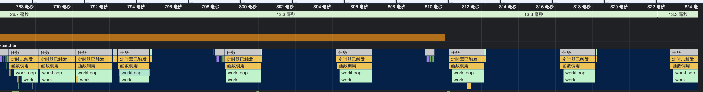
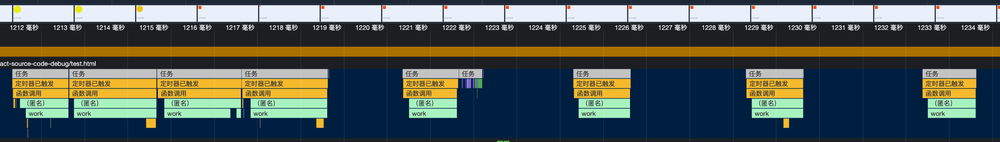
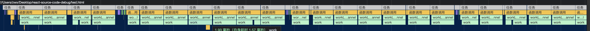
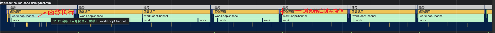
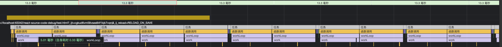
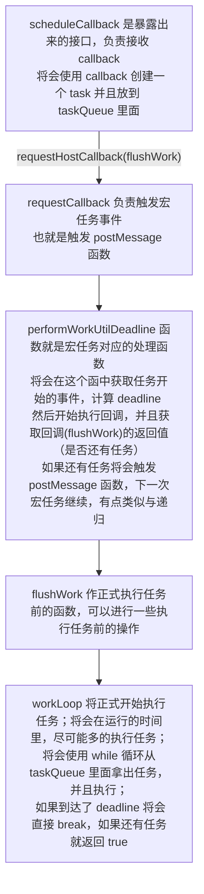

## 手写 schedule

### 参考

- [mini-react 讲得非常好，我这里几乎等于照搬了，并不是自己在探索，而是跟着大佬在学习](https://github.com/lizuncong/mini-react)

### 从一个故事开始

老板要求我做一个无限循环的动画；如下：

```html
<style>
  #animation {
    width: 30px;
    height: 30px;
    background: red;
    animation: myfirst 3s infinite alternate;
  }

  @keyframes myfirst {
    from {
      width: 30px;
      height: 30px;
      border-radius: 0;
      background: red;
    }

    to {
      width: 300px;
      height: 300px;
      border-radius: 50%;
      background: yellow;
    }
  }
</style>
<body>
  <div id="animation">test</div>
</body>
```

#### 新的需求

此时有了一个新的需求，在动画的基础上，需要执行一系列的任务，然后在任务结束后将处理任务所耗费的时间更新在页面上

```js
// *平均用时 2ms
function work() {
  const start = Date.now();

  while (Date.now() - start < 2) { };
}

function createWorks(length) {
  return new Array(length).fill(0).map(() => {
    return work;
  })
}

const works = createWorks(3000);
```

#### 同步执行

```js
function flushWorkSync() {
  console.log('invoke')
  const el = document.getElementById('animation');
  const start = Date.now();
  for (const i of works) {
    i();
  }
  el.innerText = `${Date.now() - start}ms`;
}
```

3000 个 work，每个 work 平均占用 2ms 那么一共将占用 6000ms 的时间；因为使用同步执行，所以在这 6s 中将会一直阻塞 js 主线程，导致画面卡住，无法进行渲染等操作；

所以同步执行肯定是不可行的;

#### setTimeout 异步执行

```js
function flushWorkSetTimeout() {
  start = Date.now();
  setTimeout(workLoop, 0);
}

function workLoop() {
  const work = works.shift();
  if (work) {
    work();
    setTimeout(workLoop, 0)
  } else {
    el.innerText = `${Date.now() - start}ms`;
  }
}
```

使用了 setTimeout 倒是不会阻塞主线程了，但是发现最后的用时是 `17991ms(每次的结果肯定不一样，只是一个大概)` 6s 的任务整整执行了 18s 才执行完成；

其实这是 setTimeout 的一个特性；setTimeout 是可以嵌套执行的，而且我们这里正是这样使用的；[当 setTimeout 的嵌套调用超过 4次 那么浏览器将强制执行 4 毫秒作为最小 timeout](https://developer.mozilla.org/zh-CN/docs/Web/API/setTimeout#%E5%BB%B6%E6%97%B6%E6%AF%94%E6%8C%87%E5%AE%9A%E5%80%BC%E6%9B%B4%E9%95%BF%E7%9A%84%E5%8E%9F%E5%9B%A0);

如果我们观察对应的 performance 就可以发现，前四次的间隔几乎为 0，第四次后，间隔就在 4ms 左右了；



---

setInterval 也会有这样的特性，只要 setInterval 中的回调连续连续调用超过 4次 那么浏览器就会强制执行 4ms 作为最小 timeout；

如下代码：

```js
function flushWorkSetInterval() {
  start = Date.now();
  const id = setInterval(() => {
    const work = works.shift();
    if (work) {
      work();
    } else {
      el.innerText = `${Date.now() - start}ms`;
      clearInterval(id);
    }
  }, 0);
}
```

如下 performance 图:



---

> 为什么 setTimeout 和 setInterval 不会阻塞主线程呢？
> 这里的知识其实是 **事件循环** 的知识，首先，准确的来说是，是**宏任务**不会阻塞主线程，因为在 事件循环 中，每执行完一个宏任务，就会去检查是否有其他的任务需要执行，比如微任务；如果没有就会进入下一次事件循环，就会再执行宏任务，然后去检查其他的任务；
>
> 在一帧中，浏览器会执行以下操作：
> 1. 事件循环
> 2. 执行 requestAnimationFrame
> 3. 执行样式计算，布局和绘制
> 4. 如果还有空闲时间，就执行 requestIdleCallback
>
> 如果在某个操作中，阻塞了 js 主线程，那么就会导致卡顿，掉帧的情况
>
> 因为宏任务在每次事件循环只会执行一次的这个机制，所以不会阻塞主线程（任务执行的时间也很重要）；
>
> 如果我们把这里的 setTimeout 换成 Promise 就同样会阻塞主线程；因为微任务的特性；

#### MessageChannel 异步执行

```js
function flushWorkChannel() {
  start = Date.now();
  const channel = new MessageChannel();

  channel.port1.onmessage = workLoopChannel;
  // *必须传入一个参数，不然会报错
  channel.port2.postMessage(null);

  function workLoopChannel() {
    const work = works.shift();
    if (work) {
      work();
      channel.port2.postMessage(null);
    } else {
      el.innerText = `${Date.now() - start}ms`;
    }
  }
}
```

MessageChannel 不会有 setTimeout 和 setInterval 的特性，所以可以频繁的触发 postMessage;

performance 图：



#### 在 MessageChannel 中一次尽可能执行多的任务

根据上面的 performance 可以看到，其实 postMessage 自身的调用也是会浪费时间的，并且在一帧里，将会有多次的 postMessage 说明我们并没有把空闲时间时间利用到位；

正确的做法是，将在一次的 postMessage 中我们应该尽可能多的执行任务；

比如我的显示器，75赫兹刷新率，那么一帧就是 13.3ms；一次任务大概 2ms 所以我在一次 postMessage 中执行 6 个任务；剩下的时间留给浏览器进行其他操作；

```js
function flushWorkChannelMultiTask() {
  start = Date.now();
  const channel = new MessageChannel();

  channel.port1.onmessage = workLoopChannel;
  // *必须传入一个参数，不然会报错
  channel.port2.postMessage(null);

  function workLoopChannel() {
    for (let i = 0; i < 6; i++) {
      const work = works.shift();
      if (work) {
        work();
      } else {
        break;
      }
    }
    if (works.length) channel.port2.postMessage(null);
    else el.innerText = `${Date.now() - start}ms`;

  }
}
```

在执行速度上还是有一部分的提升：



#### 处理执行耗时未知的任务

在上一节中，明确了优化的方向，在一次 workLoop 中执行尽可能多的任务；但是上一节的任务耗时都是接近的；如果任务耗时未知呢？

如果我们不能控制单个任务的耗时，但是我们可以控制 workLoop 的耗时；其实这就是时间切片；比如我们将 workLoop 的耗时控制在 5ms 内，每次执行完一个 work 就检查当前执行时间是否超过了 5ms;

```js
function flushWorkChannelUnknownTask() {
  start = Date.now();
  const channel = new MessageChannel();
  channel.port1.onmessage = workLoop;
  channel.port2.postMessage(null);

  function workLoop() {
    const loopStart = Date.now();
    let work = works.shift();

    while (work) {
      work();
      if (Date.now() - loopStart >= 5) {
        break;
      }
      work = works.shift();
    }

    if (!works.length) {
      el.innerText = `${Date.now() - start}ms`;
    } else channel.port2.postMessage(null);
  }
}
```

performance 图中可以看到每次 workLoop 的执行耗时都在 5ms 左右：



### 开始封装

```js
// *scheduleCallback 会创建一个 task，并且放到 **taskQueue** 中，如果开始「调度」，但是为了防止同时触发多次事件，所以还需要一个全局变量(**scheduledHostCallback**)，存储当前是否已有已调度的任务
const taskQueue = [];
let scheduledHostCallback = false;

// *需要暴露出来一个方法，让用户可以使用该方法来调度任务，这个方法就是 `scheudleCallback`

// *scheduleCallback 接收一个 callback (react 中的 schedule 有三个参数：优先级, callback, 选项)
function schduleCallback(callback) {
  const newTask = {
    callback: callback,
  }
  taskQueue.push(newTask);
  
  if(!scheduledHostCallback) {
    scheduledHostCallback = true;
    // *「调度」的应该是内部的函数，而不是传入的 callback ，因为使用内部函数才能更好的掌控调度的细节；
    requestHostCallback(flushWork)
  }
  
  return newTask;
}

// *flushWork 在正式执行任务之前触发，所以可以包含一些在 workLoop 之前需要的操作；这个例子比较简单就没有；
function flushWork(initialTime) {
  return workLoop(initialTime);
}

// *将在这个函数内正式执行任务, 将在允许的时间里尽可能多的执行任务；
function workLoop(initialTime) {
  let currentTask = taskQueue[0];
  
  while(currentTask) {
    if(Date.now() > deadLine) {
      break;
    }
    
    let callback = currentTask.callback;
    callback();
    
    taskQueue.shift();
    currentTask = taskQueue[0];
  }
  
  if(currentTask) {
    return true;
  } {
    isHostCallbackScheduled = false;
    return false;
  }
}
```

调度系统使用 channel

requestCallback 专门用于触发宏任务事件

performWorkUntilDeadline 监听 channel 事件；开始执行回调，并且计算 deadline；

deadline 就是任务的结束时间，应该是「任务的开始时间」+ yieldInterval 也就是 5ms


```js
const yieldInterval = 5;
let deadline;
let scheduledHostCallback = null;
const channel = new MessageChannel();
const port = channel.port2;
channel.port1.onmessage = performWorkUntilDeadLine;

function performWorkUntilDealine() {
  if(scheduledHostCallback) {
    const current = Date.now();
    deadline = current + yieldInterval;
    const hasMoreTask = scheduledHostCallback(current);
    
    if(hasMoreTask) {// *如果还有任务，就放到下一个宏任务中进行
      port.postMessage(null);
    } else {
      scheduledHostCallback = null;
    }
  }
}

// *专门用于请求回调，即触发 postMessage 事件；
function requestHostCallback(callback) {
  scheduledHostCallback = callback;
  // 这里的 null 必须传 不然会报错；
  port.postMessage(null);
}
```

这个简易的 schedule 系统的大致流程是：



> 注意：其中 performWorkUtilDeadline 和后面的 flushWork, workLoop 都是宏任务中的操作，都是异步的；
> 
> ---
> 
> 注意：这里的schedule 只能将若干个任务切片完成，并不能将一个任务进行切片；所以如果有那种一个任务执行太久的情况，也是没有办法的；
>
> 所以说，在 schedule 真实的实现中， callback 可以返回一个函数说明当前的 callback 并没有执行完成；
> 
> 但是需要使用 schedule 的 shouldYield 来判断是否要中断了

### 添加优先级

这里我就直接使用 React Schedule 中的优先级的；

Schedule 分为五个优先级，分别对应不同的超时时间

1. ImmediatePriority -- -1
2. UserBlockingPriority -- 250
3. NormalPriority -- 5000
4. LowerPriority -- 1000
5. IdlePriority -- 用不超时

在 scheduleCallback 中可以传入优先级，然后在函数内部根据优先级创建不同的任务：

```js
// *schedule 使用的是最小堆，我这里就直接使用 sort 了
function push(queue, task) {
  queue.push(task);
  queue.sort((a, b) => {
    return a.sortIndex - b.sortIndex;
  })
}

function scheduleCallback(priorityLevel, callback) {
  let timeout;
  switch (priorityLevel) {
    case ImmediatePriority:
      timeout = IMMEDIATE_PRIORITY_TIMEOUT;
      break;
    case UserBlockingPriority:
      timeout = USER_BLOCKING_PRIORITY_TIMEOUT;
      break;
    case LowerPriority:
      timeout = LOWER_PRIORITY_TIMEOUT;
      break;
    case IdlePriority:
      timeout = IDLE_PRIORITY_TIMEOUT;
      break;
    case NormalPriority:
    default:
      timeout = NORMAL_PRIORITY_TIMEOUT;
      break;
  }
  const startTime = Date.now();
  const expiredTime = startTime + timeout;
  let newTask = {
    id: taskIdCounter++,
    startTime,
    callback: callback,
    priorityLevel,
    expiredTime,
    sortIndex: expiredTime
  }

  // *使用 push 方法可以每次添加新任务时都进行排序，高优先级任务插队就是这样的插的；
  push(taskQueue, newTask);

  if (!isHostCallbackScheduled) {
    isHostCallbackScheduled = true;
    requestHostCallback(flushWork);
  }
  return newTask;
}
```

因为我们引入了优先级这个概念，所以在执行回调的时候，如果在回调中，调度了一个高优先级的任务，那么这个任务将会被 push 到堆顶，需要针对这种情况进行处理；

```js
  // *添加了优先级后，workLoop 应该判断当前任务是否过期，如果过期了，即使应该 yield 也要继续将该任务执行完成；
  function workLoop(initialTime) {
    const currentTime = initialTime;
    currentTask = taskQueue[0];
    while (currentTask) {
      const isExpired = currentTime > currentTask.expiredTime;
      if (!isExpired && shouldYield()) {
        break;
      }
      const callback = currentTask.callback;
      // !注意：此次引入了优先级的概念，如果在 callback 中调度了高优先级的任务，那么就会插入到堆顶，需要对这种情况进行处理；
      if (typeof callback === 'function') {// *因为会有对 callback 置为 null 的操作，所以需要判断 callback 的类型
        // *因为堆顶有可能是后插入的高优先级任务，所以这里将 callback 置为 null 用来与高优先级任务进行区分；
        // *为什么是置为 null 而不是直接 shift 任务再进行执行呢？因为在执行任务之前，需要进行 shouldYield 判断；如果不执行了，怎么办呢
        currentTask.callback = null;
        // 回调的返回值可用于任务切片；后续会进行添加；
        const continuationCallback = callback(isExpired);
        // *这里也需要进行判断；因为堆顶可能并不是 currentTask 了
        if (currentTask === taskQueue[0]) {
          taskQueue.shift();
        }

      } else {
        taskQueue.shift();
      }

      currentTask = taskQueue[0];
    }
    if (currentTask) {
      return true;
    } else {
      isHostCallbackScheduled = false;
      return false;
    }
  }
```

### 添加延迟任务

```ts
const timerQueue = [];
// *标志是否有计时器在进行
let isHostTimeoutScheduled = false;

function scheduleCallback(priorityLevel, callback, options) {
  const currentTime = Date.now();
  let startTime;
  if (typeof options === 'object' && options !== null) {
    const delay = options.delay;
    if (typeof delay === 'number' && delay > 0) startTime = startTime + options.delay;
    else startTime = currentTime;
  } else startTime = currentTime;
  let timeout;
  switch (priorityLevel) {
    case ImmediatePriority:
      timeout = IMMEDIATE_PRIORITY_TIMEOUT;
      break;
    case UserBlockingPriority:
      timeout = USER_BLOCKING_PRIORITY_TIMEOUT;
      break;
    case LowerPriority:
      timeout = LOWER_PRIORITY_TIMEOUT;
      break;
    case IdlePriority:
      timeout = IDLE_PRIORITY_TIMEOUT;
      break;
    case NormalPriority:
    default:
      timeout = NORMAL_PRIORITY_TIMEOUT;
      break;
  }
  const expiredTime = startTime + timeout;
  let newTask = {
    id: taskIdCounter++,
    startTime,
    callback: callback,
    priorityLevel,
    expiredTime,
    sortIndex: -1
  }
  // *如果开始的时间 > 大于当前时间，那么说明该任务是一个延迟任务
  if (startTime > currentTime) {
    newTask.sortIndex = startTime;
    push(timerQueue, newTask);
    // !既然有延迟任务，那么在延迟完成后，应该将该任务从 timerQueue 转移到 taskQueue，于是需要一个定时器，用来执行这个操作；
    // !Schedule中 即使有很多个延迟任务，但是只会使用一个 setTimeout 这样会有效降低复杂性，schedule 中使用 requestHostTimeout 请求定时器
    // !并且每次 taskQueue 中的一个任务完成后都会去检查 timerQueue 中的是否有任务延迟完成；

    // *因为每次 taskQueue 中的任务完成后都会去检查 timerQueue, 所以如果 taskQueue 里面如果有任务话，就不需要请求定时器了；所以这里需要判断 taskQueue 是否为空
    if (taskQueue.length === 0 && timerQueue[0] === newTask) {
      // *如果已经有一个定时器了，那么应该取消这个定时器；这是因为上面已经检查了此时的 newTask 才是最紧急的延迟任务；所以应该取消上一个定时器，然后请求新的定时器
      if (isHostTimeoutScheduled) {
        cancelHostTimeout();
      } else {
        isHostTimeoutScheduled = true;
      }
      requestHostTimeout(handleTimeout, startTime - currentTime);
    }
  } else {
    newTask.sortIndex = expiredTime;
    // *使用 push 方法可以每次添加新任务时都进行排序，高优先级任务插队就是这样的插的；
    push(taskQueue, newTask);
  }

  if (!isHostCallbackScheduled) {
    isHostCallbackScheduled = true;
    requestHostCallback(flushWork);
  }
  return newTask;
}

let taskTimeoutId = -1;

function requestHostTimeout(handle, ms) {
  taskTimeoutId = setTimeout(() => {
    handle(Date.now());
  }, ms)
}

function cancelHostTimeout() {
  clearTimeout(taskTimeoutId);

  taskTimeoutId = -1;
}

// *延迟完成后的回调，那么最主要的任务就是把 timerQueue 中延迟完成的任务转移到 taskQueue
function handleTimeout(currentTime) {
  isHostTimeoutScheduled = false;
  advanceTimers(currentTime);

  // *此时已经将 timerQueue 中延迟完成的任务转移到 taskQueue 了
  if (!isHostCallbackScheduled) {// isHostCallbackScheduled 代表着 taskQueue 原先就有任务，并且正在调度
    if (taskQueue.length) {
      // *所以，这里表示没有在调度中，那么应该进入调度状态
      isHostCallbackScheduled = true;
      requestHostCallback(flushWork);
    } else {
      const timer = timerQueue[0];
      if (timer) {
        // *如果没有任务了，那么应该继续请求定时器；
        // ?为什么这里没有将 isHostTimeoutScheduled 置为 true 啊？
        // !注意这里并没有将 isHostTimeoutScheduled 设置为 true；并不是 bug 而是开发团队有意为之，因为此时根本不需要设置为 true 了
        // !isHostTimeoutScheduled 的目的是为了防止请求多个 setTimeout；目前请求 setTimeout 的地方有三个 scheduleCallback, handleTimeout, workLoop 中；
        // !其中 handleTimeout 和 workLoop 都没有将 isHostTimeoutScheduled 设置为 true
        // !handleTimeout 就是 setTimeout 的回调函数；也就是说如果只请求了一个 setTimeout 那么就只会有一个 handleTimeout，如果只有一个 handleTimeout 那么 handleTimeout 内部也就只会请求一个 setTimeout；所以要从另外两个函数下手；
        // !在 workLoop 中当 taskQueue 为空，并且 timerQueue 不会空时将会请求一个 setTimeout；在 scheduleCallback 中如果 taskQueue 为空，并且 timerQueue 的堆顶等于 newTask 的话，会请求一个 setTimeout；
        // !假设 workLoop 中请求了一个 setTimeout，这个很好实现，在一个任务的回调中再调度一个延迟任务即可；此时我们只需要在 scheduleCallback 中再次请求一个 setTimeout 就可以证明这里的错误；
        // !我们分为两种情况使用 scheduleCallback
        // !1. 直接使用 scheduleCallback 此时在 scheduleCallback 中会将 isHostTimeoutScheduled 赋值为 true 防止请求多个 setTimeout
        // !2. 在 scheduleCallback 的回调中再进行调度；在回调中进行调度就相当于在 workLoop 中调用 scheduleCallback，而 workLoop 是执行完回调之后，再 taskQueue.pop() 的，所以此时的 taskQueue 是有值，在 scheduleCallback 中无法请求 setTimeout
        // !所以在 handleTimeout 和 workLoop 中无需将 isHostTimeoutScheduled 设置为 true；但是如果不会影响实际效果的话，我还是喜欢设置为 true 更容易理解一些
        requestHostTimeout(handleTimeout, timer.startTime - currentTime);
      }
    }

  }
}

// *该函数就负责检查 timerQueue 中的任务并进行转移到 taskQueue
function advanceTimers(currentTime) {
  let currentTimer = timerQueue[0];

  while (currentTimer) {
    // *如果这个 timer 被取消掉了，那么 callback 会为 null
    if (currentTimer.callback === null) timerQueue.shift();
    else if (currentTimer.startTime <= currentTime) {// 如果开始时间 < 当前时间 那么说明已经延迟完成了
      currentTimer.sortIndex = currentTimer.expiredTime;
      push(taskQueue, currentTimer);
      timerQueue.shift();
    } else return;// *如果上面两个条件都不符合，那么说明当前的 timer 延迟还没有完成；如果堆顶的延迟都还没有完成，那么其他的也就没有完成；所以直接返回

    currentTimer = timerQueue[0];
  }
}

function flushWork(initialTime) {
  // *在 workLoop 中将会检查 timerQueue 里的任务，所以这里要清除 setTimeout
  if (isHostTimeoutScheduled) {
    cancelHostTimeout();
  }
  return workLoop(initialTime)
}

// *添加了优先级后，workLoop 应该判断当前任务是否过期，如果过期了，即使应该 yield 也要继续将该任务执行完成；
function workLoop(initialTime) {
  let currentTime = initialTime;
  advanceTimers(currentTime);
  currentTask = taskQueue[0];
  while (currentTask) {
    const isExpired = currentTime > currentTask.expiredTime;
    if (!isExpired && shouldYield()) {
      break;
    }
    const callback = currentTask.callback;
    // !注意：此次引入了优先级的概念，如果在 callback 中调度了高优先级的任务，那么就会插入到堆顶，需要对这种情况进行处理；
    if (typeof callback === 'function') {
      currentTask.callback = null;
      const continuationCallback = callback(isExpired);
      // *callback 执行完成后，应该更新 currentTime 判断后续 task 是否过期将会不准确
      currentTime = Date.now();
      if (currentTask === taskQueue[0]) {
        taskQueue.shift();
      }
      advanceTimers(currentTime);
    } else {
      taskQueue.shift();
    }

    currentTask = taskQueue[0];
  }
  if (currentTask) {
    return true;
  } else {
    isHostCallbackScheduled = false;
    const firstTimer = timerQueue[0];
    if (firstTimer) {
      requestHostTimeout(handleTimeout, firstTimer.startTime - currentTime);
    }
    return false;
  }
}
```

## 完整代码  总要内容都在代码的注释里面

注意：大概的逻辑与 react scheduler 一致，并不是所有代码都一致

```js
// *用来控制每个宏任务的执行时间；每个宏任务只允许执行 5 毫秒，超出这个时间就把控制权让给浏览器
const frameYieldMs = 5;
let deadLine = 0;
const channel = new MessageChannel();
let port = channel.port2;
channel.port1.onmessage = performWorkUntilDeadLine;
let scheduledHostCallback = null;

let taskQueue = [];
let isHostCallbackScheduled = false;

function shouldYield() {
  // *scheduer 源码中，并没有计算 deadline 而是只记录了一个开始的时间，然后每次计算 currentTime - startTime 然后与 frameYieldMs 进行比较
  const timeElapsed = deadLine - performance.now();
  if (timeElapsed < frameYieldMs) {
    // The main thread has only been blocked for a really short amount of time;
    // smaller than a single frame. Don't yield yet.
    return false;
  }
  // *scheduler 的源码中，这里还有其他判断

  return true;
}

function performWorkUntilDeadLine() {
  if (scheduledHostCallback) {
    // *React 使用的都是 perfomance.now() 它的好处都在 #小知识 里面
    const currentTime = performance.now();
    // *performWorkUntilDeadline 是 onmessage 的回调函数，表示宏任务的开始，所以在这里执行计算 deadline 很合理
    deadLine = currentTime + yieldInterval;
    // *scheduledHostCallback 就是调度的回调函数，一般都是 flushWork 所以这里一般都是 flushWork(currentTime)
    const hasMoreWork = scheduledHostCallback(currentTime);
    if (!hasMoreWork) {
      scheduledHostCallback = null
    } else {
      port.postMessage(null);
    }
  }
}

function requestHostCallback(callback) {
  scheduledHostCallback = callback;
  port.postMessage(null);
}

// *schedule 使用的是最小堆，我这里就直接使用 sort 了
function push(queue, task) {
  queue.push(task);
  queue.sort((a, b) => {
    return a.sortIndex - b.sortIndex;
  })
}

let taskIdCounter = 1;

const ImmediatePriority = 1;
const UserBlockingPriority = 2;
const NormalPriority = 3;
const LowerPriority = 4;
const IdlePriority = 5;

const IMMEDIATE_PRIORITY_TIMEOUT = -1;
const USER_BLOCKING_PRIORITY_TIMEOUT = 250;
const NORMAL_PRIORITY_TIMEOUT = 5000;
const LOWER_PRIORITY_TIMEOUT = 10000;
const IDLE_PRIORITY_TIMEOUT = 1073741823;// Math.pow(2, 30) - 1

const timerQueue = [];
// *标志是否有计时器在进行
let isHostTimeoutScheduled = false;

function scheduleCallback(priorityLevel, callback, options) {
  const currentTime = Date.now();
  let startTime;
  if (typeof options === 'object' && options !== null) {
    const delay = options.delay;
    if (typeof delay === 'number' && delay > 0) startTime = startTime + options.delay;
    else startTime = currentTime;
  } else startTime = currentTime;
  let timeout;
  switch (priorityLevel) {
    case ImmediatePriority:
      timeout = IMMEDIATE_PRIORITY_TIMEOUT;
      break;
    case UserBlockingPriority:
      timeout = USER_BLOCKING_PRIORITY_TIMEOUT;
      break;
    case LowerPriority:
      timeout = LOWER_PRIORITY_TIMEOUT;
      break;
    case IdlePriority:
      timeout = IDLE_PRIORITY_TIMEOUT;
      break;
    case NormalPriority:
    default:
      timeout = NORMAL_PRIORITY_TIMEOUT;
      break;
  }
  const expiredTime = startTime + timeout;
  let newTask = {
    id: taskIdCounter++,
    startTime,
    callback: callback,
    priorityLevel,
    expiredTime,
    sortIndex: -1
  }
  // *如果开始的时间 > 大于当前时间，那么说明该任务是一个延迟任务
  if (startTime > currentTime) {
    newTask.sortIndex = startTime;
    push(timerQueue, newTask);
    // !既然有延迟任务，那么在延迟完成后，应该将该任务从 timerQueue 转移到 taskQueue，于是需要一个定时器，用来执行这个操作；
    // !Schedule中 即使有很多个延迟任务，但是只会使用一个 setTimeout 这样会有效降低复杂性，schedule 中使用 requestHostTimeout 请求定时器
    // !并且每次 taskQueue 中的一个任务完成后都会去检查 timerQueue 中的是否有任务延迟完成；

    // *因为每次 taskQueue 中的任务完成后都会去检查 timerQueue, 所以如果 taskQueue 里面如果有任务话，就不需要请求定时器了；所以这里需要判断 taskQueue 是否为空
    if (taskQueue.length === 0 && timerQueue[0] === newTask) {
      // *如果已经有一个定时器了，那么应该取消这个定时器；这是因为上面已经检查了此时的 newTask 才是最紧急的延迟任务；所以应该取消上一个定时器，然后请求新的定时器
      if (isHostTimeoutScheduled) {
        cancelHostTimeout();
      } else {
        isHostTimeoutScheduled = true;
      }
      requestHostTimeout(handleTimeout, startTime - currentTime);
    }
  } else {
    newTask.sortIndex = expiredTime;
    // *使用 push 方法可以每次添加新任务时都进行排序，高优先级任务插队就是这样的插的；
    push(taskQueue, newTask);
  }

  // *isHostCallbackScheduled 代表 requestHostCallback 已经执行了，宏任务正在待命，避免重复触发
  if (!isHostCallbackScheduled) {
    isHostCallbackScheduled = true;
    requestHostCallback(flushWork);
  }
  return newTask;
}

let taskTimeoutId = -1;

function requestHostTimeout(handle, ms) {
  taskTimeoutId = setTimeout(() => {
    handle(Date.now());
  }, ms)
}

function cancelHostTimeout() {
  clearTimeout(taskTimeoutId);

  taskTimeoutId = -1;
}

// *延迟完成后的回调，那么最主要的任务就是把 timerQueue 中延迟完成的任务转移到 taskQueue
function handleTimeout(currentTime) {
  isHostTimeoutScheduled = false;
  advanceTimers(currentTime);

  // *此时已经将 timerQueue 中延迟完成的任务转移到 taskQueue 了
  if (!isHostCallbackScheduled) {// isHostCallbackScheduled 代表着 taskQueue 原先就有任务，并且正在调度
    if (taskQueue.length) {
      // *所以，这里表示没有在调度中，那么应该进入调度状态
      isHostCallbackScheduled = true;
      requestHostCallback(flushWork);
    } else {
      const timer = timerQueue[0];
      if (timer) {
        // *如果没有任务了，那么应该继续请求定时器；
        // ?为什么这里没有将 isHostTimeoutScheduled 置为 true 啊？
        // !注意这里并没有将 isHostTimeoutScheduled 设置为 true；并不是 bug 而是开发团队有意为之，因为此时根本不需要设置为 true 了
        // !isHostTimeoutScheduled 的目的是为了防止请求多个 setTimeout；目前请求 setTimeout 的地方有三个 scheduleCallback, handleTimeout, workLoop 中；
        // !其中 handleTimeout 和 workLoop 都没有将 isHostTimeoutScheduled 设置为 true
        // !handleTimeout 就是 setTimeout 的回调函数；也就是说如果只请求了一个 setTimeout 那么就只会有一个 handleTimeout，如果只有一个 handleTimeout 那么 handleTimeout 内部也就只会请求一个 setTimeout；所以要从另外两个函数下手；
        // !在 workLoop 中当 taskQueue 为空，并且 timerQueue 不会空时将会请求一个 setTimeout；在 scheduleCallback 中如果 taskQueue 为空，并且 timerQueue 的堆顶等于 newTask 的话，会请求一个 setTimeout；
        // !假设 workLoop 中请求了一个 setTimeout，这个很好实现，在一个任务的回调中再调度一个延迟任务即可；此时我们只需要在 scheduleCallback 中再次请求一个 setTimeout 就可以证明这里的错误；
        // !我们分为两种情况使用 scheduleCallback
        // !1. 直接使用 scheduleCallback 此时在 scheduleCallback 中会将 isHostTimeoutScheduled 赋值为 true 防止请求多个 setTimeout
        // !2. 在 scheduleCallback 的回调中再进行调度；在回调中进行调度就相当于在 workLoop 中调用 scheduleCallback，而 workLoop 是执行完回调之后，再 taskQueue.pop() 的，所以此时的 taskQueue 是有值，在 scheduleCallback 中无法请求 setTimeout
        // !所以在 handleTimeout 和 workLoop 中无需将 isHostTimeoutScheduled 设置为 true；但是如果不会影响实际效果的话，我还是喜欢设置为 true 更容易理解一些
        requestHostTimeout(handleTimeout, timer.startTime - currentTime);
      }
    }

  }
}

// *该函数就负责检查 timerQueue 中的任务并进行转移到 taskQueue
function advanceTimers(currentTime) {
  let currentTimer = timerQueue[0];

  while (currentTimer) {
    // *如果这个 timer 被取消掉了，那么 callback 会为 null
    if (currentTimer.callback === null) timerQueue.shift();
    else if (currentTimer.startTime <= currentTime) {// 如果开始时间 < 当前时间 那么说明已经延迟完成了
      currentTimer.sortIndex = currentTimer.expiredTime;
      push(taskQueue, currentTimer);
      timerQueue.shift();
    } else return;// *如果上面两个条件都不符合，那么说明当前的 timer 延迟还没有完成；如果堆顶的延迟都还没有完成，那么其他的也就没有完成；所以直接返回

    currentTimer = timerQueue[0];
  }
}

let currentTask = null;

function flushWork(initialTime) {
  // 在 workLoop 中将会检查 timerQueue 里的任务，所以这里要清除 setTimeout
  if (isHostTimeoutScheduled) {
    cancelHostTimeout();
  }
  return workLoop(initialTime)
}

// *添加了优先级后，workLoop 应该判断当前任务是否过期，如果过期了，即使应该 yield 也要继续将该任务执行完成；
function workLoop(initialTime) {
  let currentTime = initialTime;
  advanceTimers(currentTime);
  currentTask = taskQueue[0];
  while (currentTask) {
    const isExpired = currentTime > currentTask.expiredTime;
    // *如果这个任务还没有过期，并且已经到达宏任务可以执行的最长时间，那么就会中断 while 将控制权交给浏览器；
    // *如果任务过期了，即使该宏任务已经达到可以执行的最长时间，那么依然会把这个任务执行完成；
    if (!isExpired && shouldYield()) {
      break;
    }
    const callback = currentTask.callback;
    // !注意：此次引入了优先级的概念，如果在 callback 中调度了高优先级的任务，那么就会插入到堆顶，需要对这种情况进行处理；
    if (typeof callback === 'function') {
      currentTask.callback = null;
      const continuationCallback = callback(isExpired);
      // *callback 执行完成后，应该更新 currentTime 判断后续 task 是否过期将会不准确
      currentTime = performance.now();
      
      // !这里执行的是任务切片操作；如果一个 task 返回一个 函数，那么说明这个任务还没有执行完成；所以不会把这个 task 弹出去；而是在下一个循环中继续执行；
      if(typeof continuationCallback === 'function') {
        currentTask.callback = continuationCallback;
      } else if (currentTask === taskQueue[0]) {
        taskQueue.shift();
      }
      // *每次循环完成都回去检查 timerQueue
      advanceTimers(currentTime);
    } else {
      taskQueue.shift();
    }

    currentTask = taskQueue[0];
  }
  if (currentTask) {
    return true;
  } else {
    isHostCallbackScheduled = false;
    const firstTimer = timerQueue[0];
    if (firstTimer) {
      requestHostTimeout(handleTimeout, firstTimer.startTime - currentTime);
    }
    return false;
  }
}
```

## 小知识

1. React 使用的都是 `performance.now()` 而不是 `Date.now()` 
   - `performance.now()` 精度更高，不只是毫秒级，精度最高可达微妙；
   - `performance.now()` 是以恒定速率缓慢增加的，不会受到系统时间的影响
2. 在三个地方会去检查 timerQueue
   1. handleTimeout 
   2. workLoop 刚开始的时候
   3. workLoop 每次循环完成