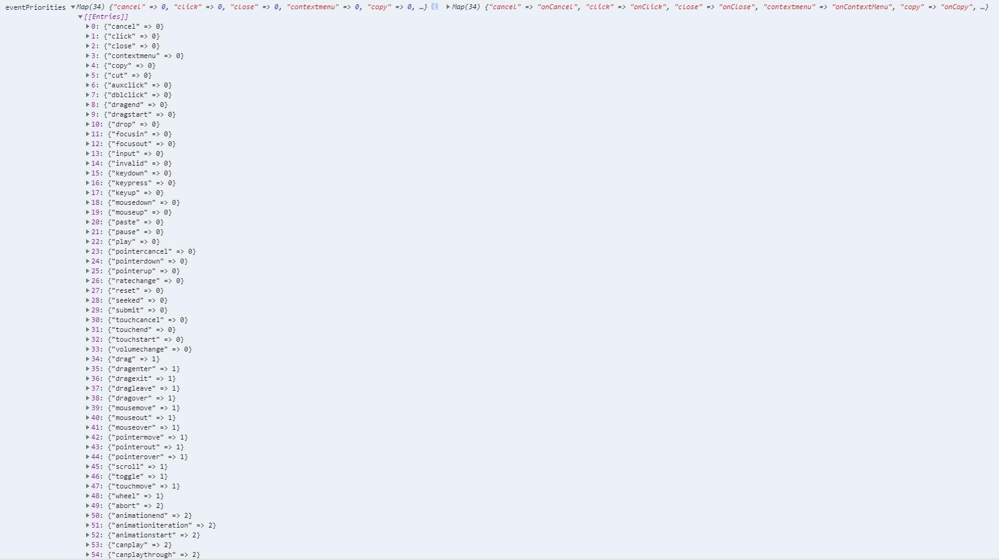

## 调度与调和

在其他的很多代码，都穿插了 schedule 所以需要好好地研究一下调度和调和才行

可以先看一下[注意](#注意)里面的第一点，要打开异步更新的话需要使用 `createRoot`, 对于 `reactDOM.render` 还是默认使用同步的更新的，也就是 v15 之前的行为。

注意：以下内容暂时为 v17 版本。

### 参考资料

1. 小册 -> [原理篇-调度](https://juejin.cn/book/6945998773818490884/section/7031002697515925545)
2. github -> https://github.com/neroneroffy/react-source-code-debug/blob/master/docs/%E8%B0%83%E5%BA%A6%E6%9C%BA%E5%88%B6/Scheduler.md
3. [**优先级 + 位运算**](https://juejin.cn/post/7039961115803009055)

### 优先级

在 react 中主要分为两类优先级：`scheduler 优先级` 和 `lane 优先级`

因为 react 不止针对于 web 环境，比如还有 reactNative，scheduler 是一个独立的包，专门用于进行调度。所以 scheduler 有一套自己的优先级。

react 中使用在文件 [SchedulerWithReactIntegration](src/react/v17/react-reconciler/src/SchedulerWithReactIntegration.old.js) 中的函数进行优先级的互相转换。

- [lane](src/react/v17/react-reconciler/src/ReactFiberLane.js) 优先级：主要用于任务调度前，对当前正在进行的任务和被调度任务做一个优先级校验，判断是否需要打断当前正在进行的任务；
- `event 优先级`：本质上也是lane优先级，lane优先级是通用的，event优先级更多是结合浏览器原生事件，对lane优先级做了分类和映射
  
- [scheduler](src/react/v17/scheduler/src/SchedulerPriorities.js) 优先级：主要用在时间分片中任务过期时间的计算

#### 优先级的转换

1. lane优先级 转 event优先级（参考 [lanesToEventPriority](src/react/v18/react-reconciler/src/ReactEventPriorities.old.js) 函数）
   - 转换规则：以区间的形式根据传入的lane返回对应的 event 优先级。比如传入的优先级不大于 Discrete 优先级，就返回 Discrete 优先级，以此类推
2. event优先级 转 scheduler优先级（参考 [ensureRootIsScheduled](src/react/v18/react-reconciler/src/ReactFiberWorkLoop.old.js) 函数）
   - 转换规则，可以看 [文章](https://juejin.cn/post/7039961115803009055) 对应的 event优先级 表。
3. event优先级 转 lane优先级（参考 [getEventPriority](src/react/v18/react-dom/src/events/ReactDOMEventListener.js) 函数）
   - 转换规则：对于非离散、连续的事件，会根据一定规则作转换，具体参考上面 event 优先级表

### 问题

1. [render](src/react/v17.0.0-alpha.0/react-dom/src/client/ReactDOMLegacy.js) 时是如何从 updateContainer 进入 beginWork 的。
2. [批量更新](src/react/v17/react-reconciler/src/ReactFiberWorkLoop.old.js)到底是如何起作用的？为什么在 scheduleUpdateOnFiber 中并没有看到 isBatchingEventUpdates？
3. 调度和调和是如何中断进行中的任务，又是如何重启之前被中断的任务的？

### legacy 模式

`reactDOM.render` 使用的就是 legacy 模式，也就是同步更新。

在 legacy 模式下，所有的任务都是紧急任务，那么只需要按照顺序进行执行就行了。也可以理解成没有优先级的概念，所有的 Update 都按照顺序进行更新。

### concurrent 模式

需要使用 `createRoot` 开启异步更新模式。

在 concurrent 模式下，将会按照优先级优先办理高优先级任务，然后办理低优先级任务；为了保证低优先级任务的执行，也会给低优先级任务一个过期时间，达到过期时间时，将会破格执行低优先级任务。

### 重点 schedulerUpdateOnFiber

schedulerUpdateOnFiber 是调度的入口，非常的重要。

```flow js
export function scheduleUpdateOnFiber(
  fiber: Fiber,
  lane: Lane,
  eventTime: number,
) {
  // *判断更新的嵌套次数，如果嵌套次数太多，那么就会抛出错误；避免无限循环的情况；一般情况下嵌套 50 层将会报错。
  checkForNestedUpdates();
  warnAboutRenderPhaseUpdatesInDEV(fiber);

  // 1 将优先级合并到当前 Fiber 节点的 lanes 属性中
  // 2 将优先级合并到父级节点的 childLanes 属性中（告诉父节点他的子节点有多少条赛道要跑） 注意使用了 while 循环，是合并到所有的父级节点了
  // *详细内容在👇
  const root = markUpdateLaneFromFiberToRoot(fiber, lane);
  // *root 为 null 时应该是不正确的情况，所以直接返回 null
  if (root === null) {
    warnAboutUpdateOnUnmountedFiberInDEV(fiber);
    return null;
  }

  // Mark that the root has a pending update.
  markRootUpdated(root, lane, eventTime);

  if (root === workInProgressRoot) {
    // Received an update to a tree that's in the middle of rendering. Mark
    // that there was an interleaved update work on this root. Unless the
    // `deferRenderPhaseUpdateToNextBatch` flag is off and this is a render
    // phase update. In that case, we don't treat render phase updates as if
    // they were interleaved, for backwards compat reasons.
    if (
      deferRenderPhaseUpdateToNextBatch ||
      (executionContext & RenderContext) === NoContext
    ) {
      workInProgressRootUpdatedLanes = mergeLanes(
        workInProgressRootUpdatedLanes,
        lane,
      );
    }
    if (workInProgressRootExitStatus === RootSuspendedWithDelay) {
      // The root already suspended with a delay, which means this render
      // definitely won't finish. Since we have a new update, let's mark it as
      // suspended now, right before marking the incoming update. This has the
      // effect of interrupting the current render and switching to the update.
      // TODO: Make sure this doesn't override pings that happen while we've
      // already started rendering.
      markRootSuspended(root, workInProgressRootRenderLanes);
    }
  }

  // TODO: requestUpdateLanePriority also reads the priority. Pass the
  // priority as an argument to that function and this one.
  // 根据Scheduler的优先级获取到对应的React优先级
  const priorityLevel = getCurrentPriorityLevel();

  if (lane === SyncLane) {
    if (
      // *本次更新还在 '未批量更新' 中
      // Check if we're inside unbatchedUpdates
      (executionContext & LegacyUnbatchedContext) !== NoContext &&
      // *且本次更新不是 render 或 commit
      // Check if we're not already rendering
      (executionContext & (RenderContext | CommitContext)) === NoContext
    ) {
      // 如果是本次更新是同步的，并且当前未在渲染流程中，那么
      // 调用performSyncWorkOnRoot开始执行同步任务

      // Register pending interactions on the root to avoid losing traced interaction data.
      schedulePendingInteractions(root, lane);// schedule pending interactions 调度待处理的交互

      // This is a legacy edge case. The initial mount of a ReactDOM.render-ed
      // root inside of batchedUpdates should be synchronous, but layout updates
      // should be deferred until the end of the batch.
      performSyncWorkOnRoot(root);// 执行同步任务
    } else {
      // 如果是本次更新是同步的，但是当前处在同步更新过程中，
      // 因为无法打断，所以调用ensureRootIsScheduled
      // 目的是去复用已经在更新的任务，让这个已有的任务
      // 把这次更新顺便做了
      ensureRootIsScheduled(root, eventTime);
      schedulePendingInteractions(root, lane);
      if (executionContext === NoContext) {
        // Flush the synchronous work now, unless we're already working or inside
        // a batch. This is intentionally inside scheduleUpdateOnFiber instead of
        // scheduleCallbackForFiber to preserve the ability to schedule a callback
        // without immediately flushing it. We only do this for user-initiated
        // updates, to preserve historical behavior of legacy mode.
        resetRenderTimer();
        flushSyncCallbackQueue();
      }
    }
  } else {
    // Schedule a discrete update but only if it's not Sync.
    // 只在异步的情况下调度一个离散更新
    // rootsWithPendingDiscreteUpdates只与React的测试用例相关
    // 可暂时先不关注
    if (
      (executionContext & DiscreteEventContext) !== NoContext &&
      // Only updates at user-blocking priority or greater are considered
      // discrete, even inside a discrete event.
      (priorityLevel === UserBlockingSchedulerPriority ||
        priorityLevel === ImmediateSchedulerPriority)
    ) {
      // This is the result of a discrete event. Track the lowest priority
      // discrete update per root so we can flush them early, if needed.
      if (rootsWithPendingDiscreteUpdates === null) {
        rootsWithPendingDiscreteUpdates = new Set([root]);
      } else {
        rootsWithPendingDiscreteUpdates.add(root);
      }
    }
    // Schedule other updates after in case the callback is sync.
    // 如果是更新是异步的，调用ensureRootIsScheduled去进入异步调度
    ensureRootIsScheduled(root, eventTime);
    schedulePendingInteractions(root, lane);
  }

  // We use this when assigning a lane for a transition inside
  // `requestUpdateLane`. We assume it's the same as the root being updated,
  // since in the common case of a single root app it probably is. If it's not
  // the same root, then it's not a huge deal, we just might batch more stuff
  // together more than necessary.
  mostRecentlyUpdatedRoot = root;
}
```

#### markUpdateLaneFromFiberToRoot

```flow js
// *更新 fiber 的 lanes，并且更新所有父级 fiber 的 childLanes；最后返回 HostRoot
function markUpdateLaneFromFiberToRoot(
  sourceFiber: Fiber,
  lane: Lane,
): FiberRoot | null {
  // Update the source fiber's lanes
  // 更新现有fiber上的lanes
  sourceFiber.lanes = mergeLanes(sourceFiber.lanes, lane);
  // 获取现有fiber的alternate，通过alternate是否为null，来区分是否是更新过程
  let alternate = sourceFiber.alternate;
  // 如果 alternate 为 null 那么说明当前 fiber 在视口中没有。
  if (alternate !== null) {
    // alternate.lanes 也要进行更新
    alternate.lanes = mergeLanes(alternate.lanes, lane);
  }
  if (__DEV__) {
    if (
      alternate === null &&
      (sourceFiber.flags & (Placement | Hydrating)) !== NoFlags
    ) {
      warnAboutUpdateOnNotYetMountedFiberInDEV(sourceFiber);
    }
  }
  // Walk the parent path to the root and update the child expiration time.
  // *从产生更新的fiber节点开始，通过 while 循环向上收集 childLanes
  // *在第一次 render 阶段，node 就等于 HostRoot 所以不会进入 while 循环
  let node = sourceFiber;
  let parent = sourceFiber.return;
  while (parent !== null) {
    // *与上面的方法一样，但是注意这里更新的不是 lanes 而是 childLanes
    parent.childLanes = mergeLanes(parent.childLanes, lane);
    alternate = parent.alternate;
    if (alternate !== null) {
      // *同样的 alternate.childLanes 也要进行更新
      alternate.childLanes = mergeLanes(alternate.childLanes, lane);
    } else {
      if (__DEV__) {
        if ((parent.flags & (Placement | Hydrating)) !== NoFlags) {
          warnAboutUpdateOnNotYetMountedFiberInDEV(sourceFiber);
        }
      }
    }
    // *然后指向 parent
    node = parent;
    parent = parent.return;
  }
  if (node.tag === HostRoot) {
    const root: FiberRoot = node.stateNode;
    return root;
  } else {
    return null;
  }
}
```

#### markRootUpdated

主要作用：

1. 将 updateLane 放入 root.pendingLanes
2. 取消 root.suspendedLanes 和 root.pingedLanes 中同等或者低于 updateLane 优先级的更新
3. 将 updateLane 对应的 eventTime 放到 root.eventTimes 的对应位置

```flow js
export function markRootUpdated(
  root: FiberRoot,
  updateLane: Lane,
  eventTime: number,
) {

  // 将本次更新的lane放入root的pendingLanes
  root.pendingLanes |= updateLane;

  // TODO: Theoretically, any update to any lane can unblock any other lane. But
  // it's not practical to try every single possible combination. We need a
  // heuristic to decide which lanes to attempt to render, and in which batches.
  // For now, we use the same heuristic as in the old ExpirationTimes model:
  // retry any lane at equal or lower priority, but don't try updates at higher
  // priority without also including the lower priority updates. This works well
  // when considering updates across different priority levels, but isn't
  // sufficient for updates within the same priority, since we want to treat
  // those updates as parallel.
  // 理论上，对任何lane的任何更新都可以解除对其他lane的封锁。但是尝试每一个可能的组合是不实际的。
  // 我们需要一种启发式算法来决定渲染哪些lanes要被尝试渲染，以及在哪个批次中处理它。当前是用的是
  // 与之前的过期时间模式相同的方式：对于优先级相同或者较低的lane进行重新处理，但是如果没有包含较
  // 低优先级的更新，就不会去处理高优先级的更新。当考虑跨不同优先级级别的更新时，这种方法很合适，但
  // 对于相同优先级的更新来说，这是不够的，因为我们希望对这些update并行处理。

  // 上面的意思是，现有的lanes优先级机制是模拟expirationTime的优先级机制，若在lanes中存在高低两种
  // 优先级的任务，那么会在高优先级任务完成后，再回来做低优先级的任务。比如lanes: 0b001100，React会
  // 优先处理倒数第三个1，完事之后再处理倒数第四个1，如果这两个1属于不同的优先级级别倒还好说，比如倒数
  // 第三个是A优先级集合中的一个lane，倒数第四个是B优先级集合中的一个lane，那么这是跨优先级层级的正常
  // 更新行为，但是如果这两个1都是属于B优先级集合中的lane，那么问题来了，现有的行为还是沿用上面提到的
  // 模拟expirationTime优先级机制下的更新行为，即做完高优任务回过头重做低优任务，但是React的希望是在
  // 一次更新任务中把两个1都处理掉，所以这里写了个Todo

  // Unsuspend any update at equal or lower priority.
  // 取消同等或较低优先级的更新。

  const higherPriorityLanes = updateLane - 1; // Turns 0b1000 into 0b0111
  // (before) suspendedLanes 0b10100
  //                         &
  // higherPriorityLanes     0b10011
  // ----------------------------------
  // (after)  suspendedLanes 0b10000  这样就只剩下比 0b00100 高的优先级了，
  // 当 suspendedLanes, pingedLanes 进行 & 运算时，也就会去掉这两个 lanes 的 "同等或较低优先级"
  // 实现上方注释中的 “取消同等或较低优先级的更新。”
  root.suspendedLanes &= higherPriorityLanes;
  root.pingedLanes &= higherPriorityLanes;

  /**
   * *假设 lanes：0b000100
   * *那么eventTimes是这种形式： [ -1, -1, -1, 44573.3452, -1, -1 ]
   * *用一个数组去存储eventTimes，-1表示空位，非-1的位置与lanes中的1的位置相同
   * */
  const eventTimes = root.eventTimes;// 因为有 31 条赛道，所以 eventTimes 是一个 31 长度的数组
  // *计算获得 lane 对应的 index，位运算的解释可以看 调度与调和.md -> 参考资料第三个
  const index = laneToIndex(updateLane);
  // We can always overwrite an existing timestamp because we prefer the most
  // recent event, and we assume time is monotonically increasing.
  eventTimes[index] = eventTime;
}
```

### 注意

在 react v17 中并不会默认打开**并发更新**，具体的可以看这篇[文章](https://juejin.cn/post/7031375070882693150)

注意：虽然 v17 中没有默认打开并发更新，但是采用的依然是 Fiber 架构，所以并不是递归进行更新的，而是可中断的更新。