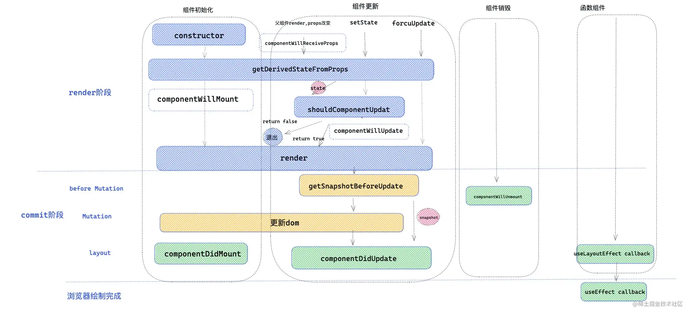
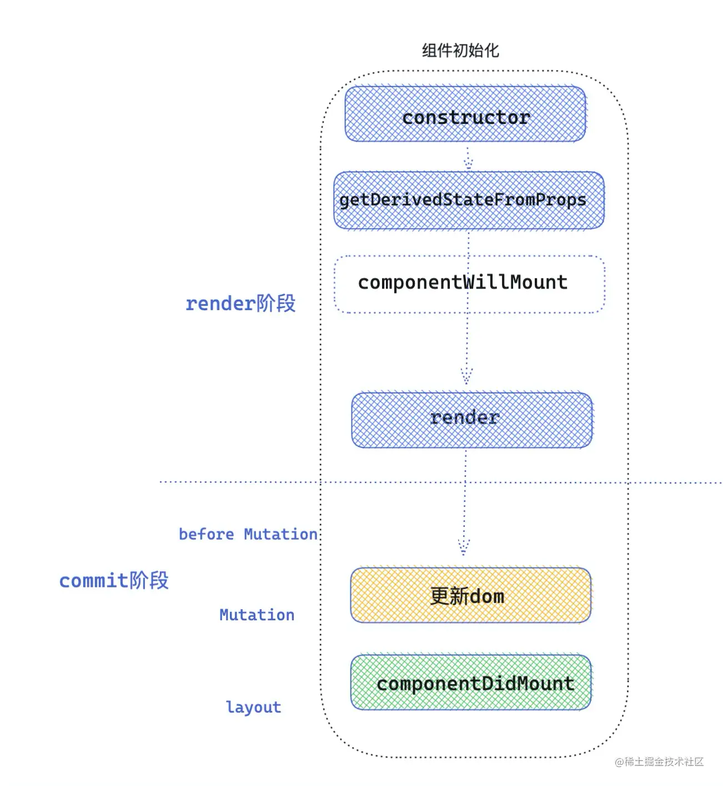
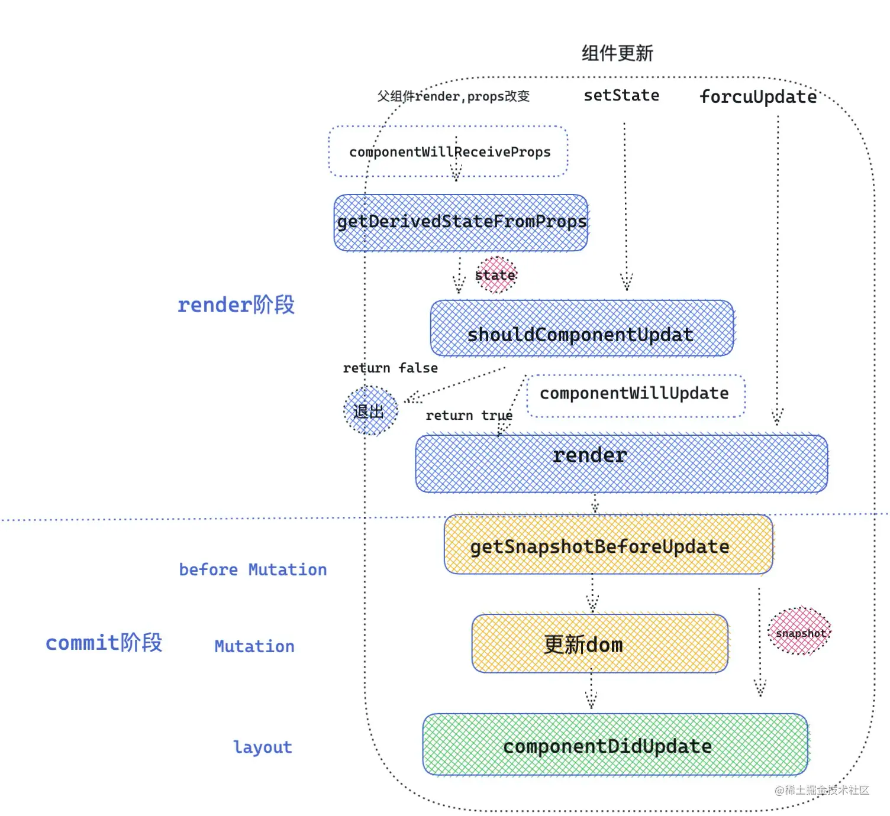
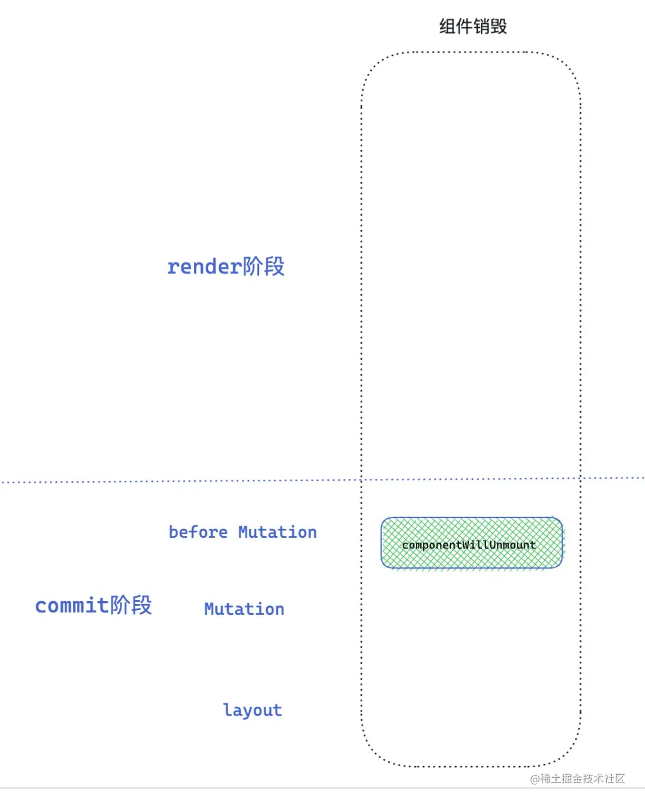
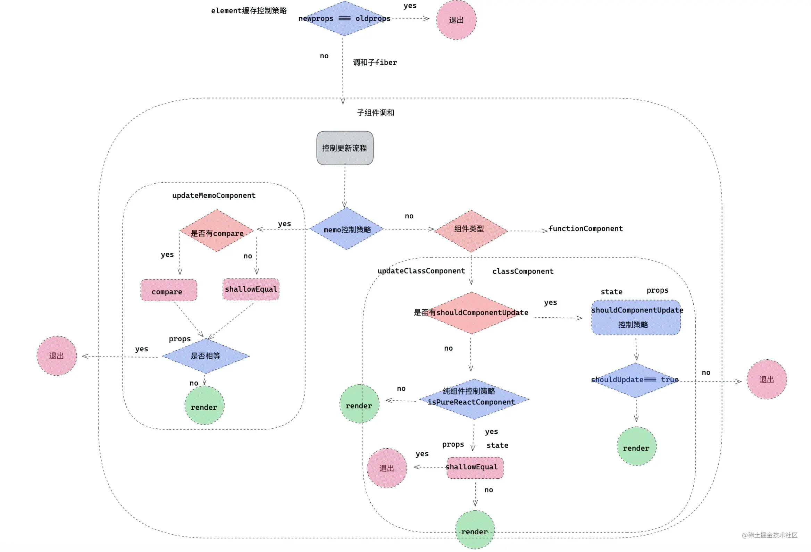
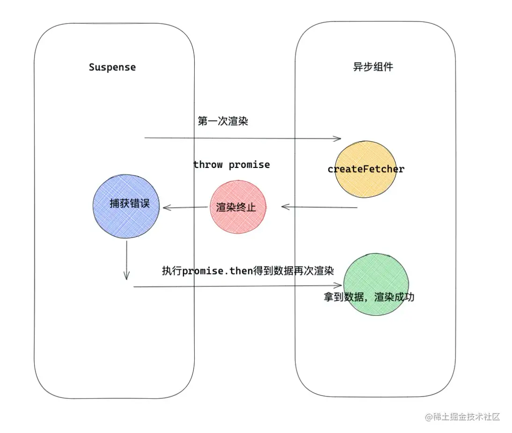
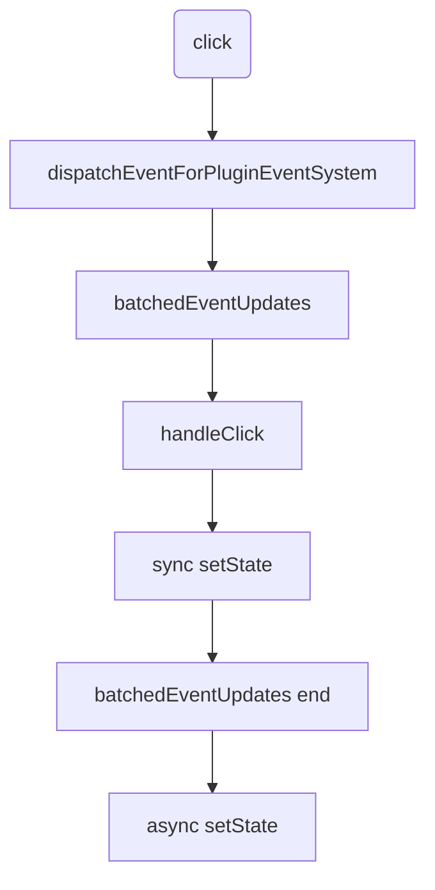

## 笔记

源自掘金-[React 进阶指南](https://juejin.cn/book/6945998773818490884)

感觉先看这个掘金小册再看视频会好一些.

补充：在学习的过程中发现了这个存储库，首先非常感谢 [原仓库](https://github.com/neroneroffy/react-source-code-debug) 然后我也会在这个仓库学习 react 并进行更新！

### 生命周期

具体原理请看章节：https://juejin.cn/book/6945998773818490884/section/6952042099374030863

> 注意以下生命周期应该只适用于 SPA(单页面应用) 不实用与 SSR(服务器端渲染)

因为 classComponent 生命周期的存在，所以即使 functionComponent 是主流但是 classComponent 依旧会存在

总生命周期概览：



#### classComponent 的生命周期

##### 挂载时的执行顺序

源代码见：[mountClassInstance](sourcecode/react/packages/react-reconciler/src/ReactFiberClassComponent.old.js)



##### 更新时的执行顺序

源代码见：[updateClassInstance](sourcecode/react/packages/react-reconciler/src/ReactFiberClassComponent.old.js)



##### 销毁时的执行顺序

销毁阶段就比较简单了，在一次调和更新中，如果发现元素被移除，就会打对应的 Deletion
标签，例如：`childToDelete.flags = Deletion;`，然后在 commit 阶段就会调用 `componentWillUnmount` 生命周期，接下来统一卸载组件以及
DOM 元素。



#### functionComponent 的生命周期

从图中看的很清楚了，函数组件没有那么多的生命周期，只有 `useLayoutEffect` 与 `useEffect` 用于处理副作用

`useLayoutEffect` 在 DOM 更新完成后同步调用回调函数。

`useEffect` 则是在每次渲染结束后，callback 将会在一个延迟事件中被调用，也就是说是异步的。

> 在 React18 中新增了 `useInsertionEffect` 与 `useLayoutEffect` 类似，只是在 更新DOM 之前进行执行 callback。类似于
> classComponent 的 `getSnapshotBeforeUpdate`

上述的在内容在[官方文档](https://zh-hans.reactjs.org/docs/hooks-reference.html#useeffect)就可以找到

### ref

章节[链接](https://juejin.cn/book/6945998773818490884/section/6953939191776411689)

可以在章节中看一下 ref 的各种使用方法

#### classComponent & ref

classComponent 定义 ref 有三种方式：

1. ref 是字符串

>
注意：不建议使用这种方法，这种方法已经过时了。https://zh-hans.reactjs.org/docs/refs-and-the-dom.html#legacy-api-string-refs

```jsx
class Test extends React.Component {

  // componentDidMount 在更新 DOM 后执行
  componentDidMount() {
    // *直接打印 div 元素
    console.log(this.refs.divRef);
  }

  render() {
    return (
      <div ref="divRef">Test</div>
    );
  }
}
```

2. ref 是一个函数

**注意**：经过测试，functionComponent 也可以使用这样的方式，而且也是直接打印 div 元素。

```jsx
class Test extends React.Component {
  componentDidMount() {
    console.log(this.divRef); // *直接打印 div 元素
  }

  render() {
    return (
      <div ref={(node) => {
        this.divRef = node;
      }}>Test</div>
    );
  }
}
```

3. 使用 `createRef`

```jsx
class Test extends React.Component {
  divRef = React.createRef();

  componentDidMount() {
    console.log(this.divRef);// *打印 { current: div }
  }

  render() {
    return (
      <div ref={this.divRef}>Test</div>
    );
  }
}
```

**注意**：以上三种方式前两种都是直接打印 DOM 元素，`createRef` 是打印对象

---

在 classComponent 上使用 ref 时可以直接获取到它的实例，并且使用实例上的方法。但是 functionComponent 因为没有实例需要使用
forwardRef 与 useImperativeRef 暴露方法

```jsx
function Test() {
  const ref = React.useRef(null);

  // *直接打印 ClassComponent 的实例
  React.useEffect(() => {
    console.log(ref.current);
  })

  return <><ClassComponent ref={ref}/></>
}

```

#### 原理

TODO 对 FC 使用 forwardRef 与 useImperativeHandle 的 ref 是如何进行处理的。

解释：`markRef` 在 `updateHostComponent` 与 `finishClassComponent` 中被调用，也就是说只有原生 DOM 元素和 `classComponent`
才会被标记 Ref, 这就解释了为什么 forwardRef 配合 useImperativeHandle 不会进入 `commitDetachRef & commitAttachRef`
因为没有被标记 Ref.

---

demo 如下：

```jsx
class Index extends React.Component {
  state = { num: 0 }
  node = null

  render() {
    return <div>
      <div ref={(node) => {
        this.node = node
        console.log('此时的参数是什么：', this.node)
      }}>ref元素节点
      </div>
      <button onClick={() => this.setState({ num: this.state.num + 1 })}>点击</button>
    </div>
  }
}
```

点击一次按钮，将会打印两条信息

1. 此时的参数是什么：null

   此时处在 commit 的 mutation
   阶段，发生在 [commitDetachRef](sourcecode/react/packages/react-reconciler/src/ReactFiberCommitWork.old.js) 中, 源码为：

```js
function commitDetachRef(current: Fiber) {
  // *currentRef 就是上面提到的三种方式。
  // !注意：如果使用的是字符串的形式，那么在之前的代码中就以及被赋值为函数了。所以这里只能是 null, function, object 因为不推荐使用字符串了，所以可以不那么在乎
  const currentRef = current.ref;
  if (currentRef !== null) {
    // *因为在 mutation 阶段，还没有完成 DOM 的更新，所以这里将 ref 赋值为 null
    if (typeof currentRef === 'function') {
      currentRef(null);// 执行函数，传入 null
    } else {
      currentRef.current = null;
    }
  }
}
```

2. 此时的参数是什么：div

   此时处在 commit 的 layout 阶段，也就是 DOM
   更新完成，发生在 [commitAttachRef](sourcecode/react/packages/react-reconciler/src/ReactFiberCommitWork.old.js)
   中，精简源码为：

```js
function commitAttachRef(finishedWork: Fiber) {
  const ref = finishedWork.ref;
  if (ref !== null) {
    const instance = finishedWork.stateNode;
    let instanceToUse;
    // *这里判断当前 Fiber 的类型
    // !注意这里并没有判断 functionComponent 因为 functionComponent 没有实例，如果在 functionComponent 绑定 ref 那么 FC 一定要转发到其他元素上，或者使用 useImperativeHandle 进行暴露。
    // !经过测试，如果是转移到其他元素上，那么这里的 finishedWork 就是那个元素的 Fiber。但是使用 useImperativeHandle 却不会经过这个 commitAttachRef 这个函数。
    // TODO 对 FC 使用 forwardRef 与 useImperativeHandle 的 ref 是如何进行处理的。
    switch (finishedWork.tag) {
      // *如果是原生 DOM 的话，就获取它的 DOM 元素
      case HostComponent:
        instanceToUse = getPublicInstance(instance);
        break;
      default:
        // *否则直接使用 instance
        instanceToUse = instance;
    }
    // *将获取到的实例传递给 ref
    if (typeof ref === 'function') {
      ref(instanceToUse);
    } else {
      ref.current = instanceToUse;
    }
  }
}
```

当然并不是每一次 Fiber 更新都会调用 `commitDetachRef & commitAttachRef` 的，只有在 ref 更新的时候才会调用这两个方法更新
ref.

ref 其实是属于 effect
的范畴的，比如在函数 [`commitLayoutEffect`](sourcecode/react/packages/react-reconciler/src/ReactFiberWorkLoop.old.js) 遍历
effect 副作用链表，如果 flags 中包含 Ref 那么将会进入 `commitAttachRef` 进行处理。

包含 Ref 的 flags
是在哪里标记的呢？有一个函数 [`markRef`](sourcecode/react/packages/react-reconciler/src/ReactFiberBeginWork.old.js)
看这个名字就知道专门标记 Ref。

**注意**： 有两处声明了 `markRef`; `ReactFiberCompleteWork.old.js & ReactFiberBeginWork.old.js`
。一般使用的都是 `ReactFiberBeginWork` 的 `markRef`。

`markRef` 在 `updateHostComponent` 与 `finishClassComponent` 中被调用，也就是说只有原生 DOM 元素和 `classComponent` 才会被标记
Ref, 这就解释了为什么 forwardRef 配合 useImperativeHandle 不会进入 `commitDetachRef & commitAttachRef` 因为没有被标记
Ref.

见下面源码：

```js
function markRef(current: Fiber | null, workInProgress: Fiber) {
  // *workInProgress 就是 wip， current 就是 wip.alternate
  const ref = workInProgress.ref;
  if (
    // *第一次挂载，current 为 null， ref 不为 null 时
    (current === null && ref !== null) ||
    // *current.ref !== wip.ref 时
    (current !== null && current.ref !== ref)
  ) {
    // 标记 Ref
    // Schedule a Ref effect
    workInProgress.flags |= Ref;
  }
}
```

上面的源码就说的很清楚了，在更新时，ref 与上次的不同才会标记 Ref

demo 一直进行打印是因为，每次更新时，都相当于对 ref 赋值了一个新的函数。

---

假设当前的 demo 中包含：

```jsx
this.state.isShow && <div ref={() => this.node = node}>元素节点</div>
```

那么 `isShow` 变成 `false` 应该删除 div，那么 ref 应该如何卸载呢？

首先要卸载的元素将打上 `Deletion` 标记, commit
阶段时会执行 [`commitDeletion`](sourcecode/react/packages/react-reconciler/src/ReactFiberCommitWork.old.js) 将会对有 Ref
标记的元素执行 `safelyDetachRef`, 其实也就只是简单的将 ref 设置为 null 就 👌 了。

```js
function safelyDetachRef(current) {
  const ref = current.ref;
  if (ref !== null) {
    if (typeof ref === 'function') {  // 函数式 ｜ 字符串
      ref(null)
    } else {
      ref.current = null;  // ref 对象
    }
  }
}
```

### context

#### classComponent

补充一下 classComponent 如何使用 context 的消费者

context 全都使用以下代码

```js
const ThemeContext = createContext({
  color: 'red',
})

const ThemeProvider = ThemeContext.Provider;
const ThemeConsumer = ThemeContext.Consumer;
```

---

contextType 的方式

```jsx
class Test extends React.Component {
  render() {
    return (
      // *这里可以正常获取到 color
      <div style={{ color: this.context.color }}>this is Test Component</div>
    );
  }
}

// !最重要的是这里的 contextType
Test.contextType = ThemeContext;// !注意：这里的 contextType 赋值的是 ThemeContext 并不是 Provider 或 Consumer
```

---

Consumer 的方式

```jsx
class Test extends React.Component {
  render() {
    const { color } = this.props;
    return (
      <div style={{ color }}>this is Test Component</div>
    );
  }
}

const Son = () => {
  return (
    <ThemeConsumer>
      {value => <Test {...value} />}
    </ThemeConsumer>
  )
}
```

#### 动态 context

可以看一下[小册](https://juejin.cn/book/6945998773818490884/section/6957723551818317862)

大概内容就是 context 如果 Provider 发生了改变，那么所有的 children 都将重新渲染，不管是否是当前 context 的消费者。要改变这个逻辑的话，就要没有消费 context 的组件使用 memo 包裹，或者使用 PureComponent。 如果消费了 context 那么就算使用 memo PureComponent 还是会重新渲染的。

#### 模块化 CSS

这一块内容不算多，而且不算知识盲区，不用笔记，可以看[小册](https://juejin.cn/book/6945998773818490884/section/6956440391461634063)了解一下。

#### 高阶组件 HOC

### HOC 高阶组件

这一章主要讲解了高阶组件的各种用法，没有需要特别记录的，具体请看[小册](https://juejin.cn/book/6945998773818490884/section/6957722790673776671)

### 渲染控制



#### PureComponent

PureComponent 意为纯组件，它将对 state 和 props 进行浅比较，如果没有改变，那么就不会重新渲染，比如:

```jsx
class Children extends React.PureComponent{
  state={
    name:'alien',
    age:18,
    obj:{
      number:1,
    }
  }
  changeObjNumber=()=>{
    const { obj } = this.state
    obj.number++
    this.setState({ obj })
  }
  render(){
    console.log('组件渲染')
    return <div>
      <div> 组件本身改变state </div>
      <button onClick={() => this.setState({ name:'alien' }) } >state相同情况</button>
      <button onClick={() => this.setState({ age:this.state.age + 1  }) }>state不同情况</button>
      <button onClick={ this.changeObjNumber } >state为引用数据类型时候</button>
      <div>hello,my name is alien,let us learn React!</div>
    </div>
  }
}
```

上述代码中，只有点击第二个 button 才会导致重新渲染。就是因为，其他两个 button 造成的改变并不会引起浅比较结果的改变。

那么是如何进行浅比较的呢？

`PureComponent` 在 prototype 上有一个标志: `isPureReactComponent`，在 updateClassInstance （见[生命周期](#生命周期)）中将会判断当前是否应该更新，其中有一个环节就是判断它是否是 `PureReactComponent` 如果是 `PureReactComponent` 就会对 props & state 进行浅比较。

浅比较也比较简单：

1. 使用 Object.is 进行基础判断
2. 排除 null
3. 使用 Object.keys 如果两者长度不相等，那么说明新老 props or state 不相同
4. 最后遍历 keys 进行比较。

#### React.memo

React.memo 居然可以传入两个参数，才知道，第二个参数 `compare` 是一个函数，类似于 `shouldComponentUpdate` 但是返回值不同

`shoudleComponentUpdate` 返回 true 代表需要更新，返回 false 代表不需要更新

`compare` 返回 true 代表不需要更新，返回 false 代表需要更新。其实返回 true 就代表比较结果为 true 自然不需要更新. compare 不存在的时候将对 props 进行浅比较。

> 注意：memo 只是对 props 进行浅比较， PureComponent 还会对 state 进行浅比较.

#### 打破渲染限制

- [forceUpdate](https://zh-hans.reactjs.org/docs/react-component.html#forceupdate) 类组件才有，将会无视所有对比较，强行进行渲染，其原理是组件中调用 forceUpdate 时候，全局会开启一个 hasForceUpdate 的开关。当组件更新的时候，检查这个开关是否打开，如果打开，就直接跳过 shouldUpdate 。
- context 上述的几种方式，都不能本质上阻断 context 改变，而带来的渲染穿透，所以开发者在使用 Context 要格外小心，既然选择了消费 context ，就要承担 context 改变，带来的更新作用。
  > 如果没有消费 context 那么控制渲染的方法，是有效的

#### 对于 render 的思考

1. 有没有必要在乎组件不必要渲染。 在正常情况下，无须过分在乎 React 没有必要的渲染，要理解执行 render 不等于真正的浏览器渲染视图，render 阶段执行是在 js 当中，js 中运行代码远快于浏览器的 Rendering 和 Painting 的，更何况 React 还提供了 diff 算法等手段，去复用真实 DOM 。
2. 什么时候需要注意渲染节流。

   但是对于以下情况，值得开发者注意，需要采用渲染节流：

  - 第一种情况数据可视化的模块组件（展示了大量的数据），这种情况比较小心因为一次更新，可能伴随大量的 diff ，数据量越大也就越浪费性能，所以对于数据展示模块组件，有必要采取 memo ， shouldComponentUpdate 等方案控制自身组件渲染。
  - 第二种情况含有大量表单的页面，React 一般会采用受控组件的模式去管理表单数据层，表单数据层完全托管于 props 或是 state ，而用户操作表单往往是频繁的，需要频繁改变数据层，所以很有可能让整个页面组件高频率 render 。
  - 第三种情况就是越是靠近 app root 根组件越值得注意，根组件渲染会波及到整个组件树重新 render ，子组件 render ，一是浪费性能，二是可能执行 useEffect ，componentWillReceiveProps 等钩子，造成意想不到的情况发生。
3. 一些开发中的细节问题
  - 开发过程中对于大量数据展示的模块，开发者有必要用 shouldComponentUpdate ，PureComponent来优化性能。
  - 对于表单控件，最好办法单独抽离组件，独自管理自己的数据层，这样可以让 state 改变，波及的范围更小。
  - 如果需要更精致化渲染，可以配合 immutable.js 。
  - 组件颗粒化，配合 memo 等 api ，可以制定私有化的渲染空间。

### 渲染调优

内容很多，Suspense 组件原理，与 React.lazy 原理，还有 diff children 原理。具体的看[小册](https://juejin.cn/book/6945998773818490884/section/6959807335720026150)

Suspense 组件原理：



#### diff Children 流程

主要函数是：[reconcileChildrenArray](sourcecode/react/packages/react-reconciler/src/ReactChildFiber.old.js)

小册中写的看的不是很懂，参考了以下文章

1. [深入理解React Diff算法](https://juejin.cn/post/6919302952486174733)
2. [React多节点Dom Diff算法及Commit阶段节点删除更新插入移动源码剖析](https://juejin.cn/post/7120245064843919397)

```js
  /**
   * @desc diff 数组，只要你有多个子节点，那么就会编译为数组。
   * @param returnFiber
   * @param currentFirstChild
   * @param newChildren
   * @param lanes
   * @return {Fiber} 返回 firstChild，因为父 Fiber.child 就是指向 firstChild
   */
  function reconcileChildrenArray(
    returnFiber: Fiber,
    currentFirstChild: Fiber | null,
    newChildren: Array<*>,
    lanes: Lanes
  ): Fiber | null {
    let resultingFirstChild: Fiber | null = null;
    let previousNewFiber: Fiber | null = null;

    let oldFiber = currentFirstChild;
    let lastPlacedIndex = 0;
    let newIdx = 0;
    let nextOldFiber = null;

    /***
     * !提前声明：以下情况的前提是：数组中 item 的 key 是有效值，不然的话，都会进行重用的。因为是否复用，重点就在于比较 key，如果更新前后都没有 key 那么就相当于比较 null === null 很明显为 true 就会进行复用。 具体的看下面的注释
     */

    // !在实际情况中，交换元素是很罕见的情况(比如 a -> b -> c => a -> c -> b) react 没有做对应的处理，而是直接看作简单的删除和添加。
    for (; oldFiber !== null && newIdx < newChildren.length; newIdx++) {
      // *该 if-else 保证了当前 newIdx 将会 <= oldFiber.index;
      // ? newIdx 每次循环自加 1 但是 oldFiber 则是随着链表不断指向 sibling 那么什么情况下， oldFiber.index > newIdx 呢？
      // ! 解释：假设当前的 newChildren 为 [false, {type:'div'}, ...]
      // ! mount 阶段时，因为 oldFiber = null 会进入下面的 for 循环创建 Fiber
      // ! 当遍历到第一个元素时，因为是 false，将会直接跳过
      // ! 当遍历到第二个元素时，创建 Fiber，并且 index 为 1，不为 0
      // ---
      // ! 当 false 变成 { type: 'p' } 或者其他, 再次进入该循环，此时 oldFiber = returnFiber.child 也就是第一个 child，也就是上次的 {type: 'div'} 所以 index = 1， newIdx = 0
      // !这其实就相当于是 **添加元素到头部** 了，重点是：因为 oldFiber 为 null，那么 key 也就是 null，只要 添加的元素 没有 key，那么几乎一定会进行复用
      if (oldFiber.index > newIdx) {
        nextOldFiber = oldFiber;
        // oldFiber 为 null 时，将结束循环。使用其他的处理
        oldFiber = null;
      } else {
        // nextOldFiber 指向 oldFiber.sibling
        nextOldFiber = oldFiber.sibling;
      }

      // * updateSlot 将会比较 key 决定是否重用，如果没有重用的话就会返回 null， oldFiber
      // *一般来说 key 不相同的话就不会进行复用，对于没有 key 的， old 与 new 的都是 null 那么也是相同
      const newFiber = updateSlot(
        returnFiber,
        oldFiber,
        newChildren[newIdx],
        lanes,
      );

      // *说明没有复用 oldFiber ，说明当前的 child 与 oldFiber 是不对应的，可能哪里发生了改变，就需要 break 进入其他的处理。
      if (newFiber === null) {
        // TODO: This breaks on empty slots like null children. That's
        // unfortunate because it triggers the slow path all the time. We need
        // a better way to communicate whether this was a miss or null,
        // boolean, undefined, etc.
        // *这里 oldFiber 为 null 应该有两种情况
        // *第一种是 oldFiber 已经遍历完了, newChildren 还没有遍历完成。那么此时 newOldFiber 为 null
        // *第二种就是上面的 oldFiber.index > newIdx，那么此时 newOldFiber 应该有值。
        if (oldFiber === null) {
          oldFiber = nextOldFiber;
        }
        // break 退出循环，进入其他处理
        break;
      }

      // *shouldTrackSideEffects 表示当前是更新流程
      if (shouldTrackSideEffects) {
        // *目前有一个情况可以解释。当这一次更新的 type 不一样时，将会进入该 if；
        // !比如 const [tag, setTag] = useState('div'); createElement(tag, null, 'hello world'); <button onClick={() => {setTag('p')}}>click</button>; 点击按钮，修改 tag；在上面的 updateSlot 中会进入 updateElement 函数，最终创建一个新的 Fiber 然后复用 oldFiber 的一些属性。 因为是新的 Fiber 所以 alternate 自然为 null。
        // 所以进入该 if 删除 oldFiber
        if (oldFiber && newFiber.alternate === null) {
          deleteChild(returnFiber, oldFiber);
        }
      }
      // 为 newFiber 设置 index，并且将 index 返回出来
      lastPlacedIndex = placeChild(newFiber, lastPlacedIndex, newIdx);

      // *如果 previousNewFiber 是 null 那么说明是第一次循环。 在这个 if 里面记录一下 firstChild
      if (previousNewFiber === null) {
        // TODO: Move out of the loop. This only happens for the first run.
        resultingFirstChild = newFiber;
      } else {
        // *如果不是第一次循环，那么连接兄弟 Fiber
        previousNewFiber.sibling = newFiber;
      }
      previousNewFiber = newFiber;
      oldFiber = nextOldFiber;
    }

    // *如果 newIdx === newChildren.length 那么说明 newChildren 已经遍历完了，那么剩下的 Fiber 都没有用了，所以进行删除，并且返回结束函数。
    if (newIdx === newChildren.length) {
      deleteRemainingChildren(returnFiber, oldFiber);
      return resultingFirstChild;
    }

    // *如果没有遍历完，但是 oldFiber 为 null 那么说明
    // *1. 增加子节点
    // *第一个 for 循环中的 oldFiber.index > newIdx 情况应该不会进入该 if，因为上面循环中已经将会判断 oldFiber === null, 并且对 oldFiber 重新赋值了。
    // *除非重新赋值后 oldFiber 依然为 null 但是那是不可能的
    if (oldFiber === null) {
      // *除了直接使用 newChildren[newIdx] 创建 Fiber 外，其他都与第一个 for
      for (; newIdx < newChildren.length; newIdx++) {
        const newFiber = createChild(returnFiber, newChildren[newIdx], lanes);
        if (newFiber === null) {
          continue;
        }
        lastPlacedIndex = placeChild(newFiber, lastPlacedIndex, newIdx);
        if (previousNewFiber === null) {
          // TODO: Move out of the loop. This only happens for the first run.
          resultingFirstChild = newFiber;
        } else {
          previousNewFiber.sibling = newFiber;
        }
        previousNewFiber = newFiber;
      }
      return resultingFirstChild;
    }

    // *把剩下的 oldFiber 都放到 map 中，并且返回出来。 注意：map 的 key 首选是 fiber.key 其次是 fiber.index
    const existingChildren = mapRemainingChildren(returnFiber, oldFiber);

    // *目前的情况就是 newChildren 没有遍历完毕， oldFiber 也依然存在
    // *继续遍历 newChildren 注意是接着第一次 for 循环继续遍历的
    for (; newIdx < newChildren.length; newIdx++) {
      // 在上面 mapRemainingChildren 中，我们把剩下的 oldFiber 都放到了 map 中
      // *updateFromMap 函数将会判断有没有可以复用的 oldFiber，如果有就进行复用，并且返回
      const newFiber = updateFromMap(
        existingChildren,
        returnFiber,
        newIdx,
        newChildren[newIdx],
        lanes,
      );
      if (newFiber !== null) {
        if (shouldTrackSideEffects) {
          if (newFiber.alternate !== null) {
            // *如果复用了 oldFiber 那么就从 map 中删除，前面说了 map 的键值为 oldFiber.key 或者 oldFiber.index 这里是复用了 oldFiFiber 的情况，那么这里一定可以匹配到内容。
            existingChildren.delete(
              newFiber.key === null ? newIdx : newFiber.key,
            );
          }
        }
        // *接下来的内容，在上面都已经说过了
        lastPlacedIndex = placeChild(newFiber, lastPlacedIndex, newIdx);
        if (previousNewFiber === null) {
          resultingFirstChild = newFiber;
        } else {
          previousNewFiber.sibling = newFiber;
        }
        previousNewFiber = newFiber;
      }
    }

    if (shouldTrackSideEffects) {
      // 删除 map 中剩余的 Fiber
      existingChildren.forEach(child => deleteChild(returnFiber, child));
    }

    return resultingFirstChild;
  }
```

基本上把 diff 流程都过了一遍，举几个例子🌰：

```jsx
const oldChildren = (
  <div>
    <p key="p">this is p tag</p>
    <h2 key="h2">this is h2 tag</h2>
  </div>
)

const newChilren = (
  <div>
    <p key="_p">this is p tag</p>
    <h2 key="p">this is h2 tag</h2>
  </div>
)
```

diff div 时将会有如下流程：

1. `:p{ key="p" }` vs `:p{ key="_p" }` 很明显因为 key 不相等，所以直接 `newFiber = null` 表示不会复用，直接跳出第一个 for 循环
2. `newIdx !== newChildren.length` 说明还没有遍历完毕。
3. `oldFiber !== null` 说明 oldFiber 也没用遍历完成
4. 那么直接将剩余的 oldFiber 放到 map 中去，因为都有 key 所以直接以 key 作为键值。
5. 从当前的 newIdx 继续开始遍历，此时的 children 是 `:p{ key="_p" }` ，map 中没有对应的值，所以直接使用 `:p{ key="_p" }` 创建新的 Fiber 并且通过 placeChild 进行放置，并且将其 flags 赋值为 Placement
6. 遍历到 `:h2{ key="p" }` 继续在 map 中进行查找，自然找到了 `:p{ key="p" }` ，但是因为 type 不相等最后也会使用 `:h2{ key="p" }` 创建 Fiber, `newFiber !== null`，但是因为 `newFiber.alternate === null` 所以, 还是不能进行复用，最终也是打上 Placement 标签。
7. 遍历完成，如果 map 中还有值，那么将会全部删除。
8. 最后返回 firstChild

### 海量数据优化

#### 时间分片

就是一次只渲染部分内容，然后分为多次进行渲染，具体的可以看[小册](https://juejin.cn/book/6945998773818490884/section/6959872008326742028)

#### 虚拟列表

一直都对虚拟列表很好奇，今天终于看到了源码

下面的实现是需要指定 item 的高度的，但是 [ahooks](https://ahooks.js.org/zh-CN/hooks/use-virtual-list) 实现了不需要指定 item 高度的，以后可以看看源码。

```jsx
import React from "react";
import styles from './VirtualList.module.scss';

function VirtualList() {
  const [dataList, setDataList] = React.useState([])  /* 保存数据源 */
  const [position, setPosition] = React.useState([0, 0]) /* 截取缓冲区 + 视图区索引 */
  const scroll = React.useRef(null)  /* 获取scroll元素 */
  const box = React.useRef(null)     /* 获取元素用于容器高度 */
  const context = React.useRef(null) /* 用于移动视图区域，形成滑动效果。 */
  const scrollInfo = React.useRef({
    height: 500,     /* 容器高度 */
    bufferCount: 8,  /* 缓冲区个数 */
    itemHeight: 60,  /* 每一个item高度 */
    renderCount: 0,  /* 渲染区个数 */
  })

  React.useEffect(() => {
    const height = box.current.offsetHeight
    const { itemHeight, bufferCount } = scrollInfo.current
    const renderCount = Math.ceil(height / itemHeight) + bufferCount // 进行渲染的个数 = 页面上显示的个数 + 缓存的个数
    scrollInfo.current = { renderCount, height, bufferCount, itemHeight }
    const dataList = new Array(30).fill(1).map((item, index) => index + 1)
    setDataList(dataList)
    setPosition([0, renderCount])
  }, [])

  const handleScroll = () => {
    const { scrollTop } = scroll.current
    const { itemHeight, renderCount } = scrollInfo.current
    const start = Math.floor(scrollTop / itemHeight)
    const end = Math.floor(scrollTop / itemHeight + renderCount + 1)

    // !这一段非常重要，像上面计算 render start item 到 end item 我觉得很简单，都知道怎么做。但是这一步容易被忽略。
    /**
     * !在目前这个做法中，首先，我们使用了一个空 div(scroll) 撑开父盒子，这才有了滚动条。然后下一个 div(context) 使用绝对定位，显示在视口中，因为我们在滚动时，真正发生了滚动，那么 context 也会随着滚动；但是 renderList 又在 context 内部，所以 context 随着滚动的话，很明显是不对的，不然都滚动出视口了。
     * !我们就需要随着滚动，动态的改变 context 的位置，使用 left top 性能太差， 所以就使用 translate
     * 
     * !还有就是要注意这里的 currentOffset 计算方式，currentOffset 并不直接等于 scrollTop，想象一下 currentOffset 直接等于 scrollTop 的情况是怎样的？
     * !当向下滚动时 scroll 盒子其实相当于是向上移动的，那么 context 原本会跟随它一起移动，就会形成 context 被裁切的样式，但是 translate 向下唯一 scrollTop 的距离就与滚动的距离抵消了，那么 context 就会一直在顶部，不会形成 context 被裁切的样式，整体看下来会非常奇怪。可以在 component/VirtualList.jsx 中进行查看。
     * 
     * !那么应该如何进行位移呢？要想保证裁切，那么就可以恰好在裁切一整个 item 高度时，进行位移。
     * !这里的计算就是如此， scrollTop 减去 对 itemHeight 的余数，那么恰好就是 itemHeight 的倍数了。 假设 scrollTop = 451， itemHeight = 60, 那么计算值就是 420 恰好是七个 item 的高度，那么此时在视口中的就是第八个 item 余下的 29 像素内容
     * 
     * !ahooks virtualList 的实现方法不一样，使用的是 marinTop 但是无论什么实现方法，都要进行位移，匹配当前滚动。
     * */
    const currentOffset = scrollTop - (scrollTop % itemHeight)
    context.current.style.transform = `translate3d(0, ${currentOffset}px, 0)` /* 偏移，造成下滑效果 */

    if (end !== position[1] || start !== position[0]) { /* 如果render内容发生改变，那么截取  */
      setPosition([start, end])
    }
  }

  const { itemHeight, height } = scrollInfo.current
  const [start, end] = position
  const renderList = dataList.slice(start, end) /* 渲染区间 */
  console.log(position[0], position[1]);

  return <div className={styles.list_box} ref={box}>
    <div className={styles.scroll_box} style={{ height: height + 'px' }} onScroll={handleScroll} ref={scroll}>
      <div className={styles.scroll_hold} style={{ height: `${dataList.length * itemHeight}px` }}/>
      <div className={styles.context} ref={context}>
        {
          renderList.map((item, index) => <div className={styles.list} key={index}>  {item + ''} Item </div>)
        }
      </div>
    </div>
  </div>
}

export default VirtualList;
```

对应的 css

```scss
.scroll_box {
  overflow: scroll;
  position: relative;
}

.scroll_hold {
  position: absolute;
  left: 0;
  top: 0;
  right: 0;
}

.context {
  display: flex;
  justify-content: center;
  align-items: center;
  flex-direction: column;
}

.list {
  height: 55px;
  background-color: pink;
  border-radius: 5px;
  width: 200px;
  box-sizing: border-box;
  margin-bottom: 5px;
  line-height: 55px;
}
```

> 针对上面的 VirtualList 进行了优化，以下是部分代码

```jsx
// !针对上面的 VirtualList 进行了优化，以下是部分代码
const scrollInfo = React.useRef({
   height: 500,     /* 容器高度 */
   // bufferCount: 8,  /* 缓冲区个数 */
   itemHeight: 60,  /* 每一个item高度 */
   renderCount: 0,  /* 渲染区个数 */
   // *在这里进行了优化，参考了 ahooks 的 useVirtualList ，原先的 bufferCount 不能做到上下存在缓存区的情况， overscan 专门用于定义上下的缓存区个数， overscan: 2 表示滚动过程中，将在视口外存在上面两个缓冲  item，下面两个缓冲 item
   overscan: 2,
})

React.useEffect(() => {
   const height = box.current.offsetHeight
   const { itemHeight, overscan } = scrollInfo.current
   // 计算需要渲染的个数
   const renderCount = Math.ceil(height / itemHeight) + overscan * 2;
   scrollInfo.current = { renderCount, height, overscan, itemHeight }
   const dataList = new Array(30).fill(1).map((item, index) => index + 1)
   setDataList(dataList)
   setPosition([0, renderCount])
}, [])

const handleScroll = () => {
   const { scrollTop } = scroll.current
   const { itemHeight, renderCount, overscan } = scrollInfo.current
   let realScrollTop = scrollTop - overscan * itemHeight;
   realScrollTop = realScrollTop < 0 ? 0 : realScrollTop;

   // !当 scrollTop < overscan * itemHeight 时，说明此时滚动的高度，还不够缓冲区的高度，所以此时，不应该移动 context，也不应该修改 start，end。
   // !但是这里不能直接 if(realScrollTop < 0) return; 因为 scroll 事件并不是滚动每一像素都可以捕捉到，而是类似于一帧一帧的触发，很可能假设，overscan = 2, itemHeight = 60, 此时 scrollTop = 428 此时的 start = 5，如果我们此时向上滚动，刚好在 181 的地方触发一次，此时的 start = 1；下一次又在 119 的地方触发一次，可是此时的 realScrollTop < 0 直接返回的话，就会让 start 一直为 1，而不是初始的 0。
   // !正确的做法是现在这样， realScrollTop < 0 时就赋值为 0

   // *根据 realScrollTop 进行调整。
   const start = Math.floor(realScrollTop / itemHeight)
   const end = Math.floor(realScrollTop / itemHeight + renderCount + 1)

   const currentOffset = realScrollTop - (realScrollTop % itemHeight);
   console.log(currentOffset)
   context.current.style.transform = `translate3d(0, ${currentOffset}px, 0)` /* 偏移，造成下滑效果 */

   if (end !== position[1] || start !== position[0]) { /* 如果render内容发生改变，那么截取  */
      setPosition([start, end])
   }
}
```

### react 事件原理

#### 合成事件注意点

1. React 的事件不是绑定在元素上的，而是统一绑定在顶部容器上，在 v17 之前是绑定在 document 上的，在 v17 改成了 app 容器上。这样更利于一个 html 下存在多个应用（微前端）
2. 绑定事件并不是一次性绑定所有事件，比如发现了 onClick 事件，就会绑定 click 事件，比如发现 onChange 事件，会绑定 [blur，change ，focus ，keydown，keyup] 多个事件。
3. React 事件合成的概念：React 应用中，元素绑定的事件并不是原生事件，而是React 合成的事件，比如 onClick 是由 click 合成，onChange 是由 blur ，change ，focus 等多个事件合成。

#### 绑定阶段

详见：[事件系统](./docs/事件系统/zhangchuachua.md)


### 小知识

#### input 的 onchange 与 oninput

在 html 中 input 绑定 onchange 事件的表现为: **在 input 失去焦点且 value 与上次不相等时才会触发.**

```html

<body>
<input type="text" id="input"/>
<script>
    const input = document.getElementById('input');
    input.addEventListener('change', () => {
        console.log('changed')
    })
</script>
</body>
```

而在 react 中 `input` 绑定 `onChange` 事件的表现为: **每一次输入都会触发 `onChange` 事件, 更加类似于原生的 `oninput` 事件.
当然 react 中也是实现了 `onInput` 事件, 但是效果与 `onChange` 事件类似, 都是只要输入就会触发.**

```jsx
function Test() {
  const [input, setInput] = useState(0);
  const handleChange = (e) => {
    console.log('changed');
    setCount(e.target.value);
  }

  useEffect(() => {
    console.log(input)
  }, [input])

  return (
    <input type="text" onChange={handleChange}/>
  )
}
```

#### 补充 class 知识

class 在继承时, 如果没有定义 `constructor`, 这个方法将会被自动添加, 并且执行 `super`. 类似于:

```jsx
class Test extends React.Component {
  constructor(...args) {
    super(...args);
  }
}
```

#### setState & useState

##### batchedEventsUpdates 批量更新原理

React 是采用事件合成的形式，每一个事件都是由 React 事件系统统一调度的。

在 legacy 模式下，所有的事件都将由函数 dispatchEventForPluginEventSystem 统一处理，函数内部将会使用批量更新

> react v17 的路径：react-dom/src/events/DOMPluginEventSystem.js

```js
function dispatchEventForPluginEventSystem() {
  // handleTopLevel 事件处理函数
  batchedEventUpdates(handleTopLevel, bookKeeping);
}
```

batchedEventUpdates 批量更新源代码：

```js
function batchedEventUpdates(fn, a, b) {
  // *fn 就是事件函数
  if (isBatchingEventUpdates) {
    // If we are currently inside another batch, we need to wait until it
    // fully completes before restoring state.
    return fn(a, b);
  }
  // *将批量更新的标识设置为 true
  isBatchingEventUpdates = true;
  try {
    return batchedEventUpdatesImpl(fn, a, b);
  } finally {
    // *return 不会阻止 finally 的执行。
    // *标识设置为 false
    isBatchingEventUpdates = false;
    finishEventHandler();
  }
}
```

##### setState

```jsx
class Test extends Component {
  constructor(props) {
    super(props);
    this.state = { number: 0 };
  }

  // !触发事件时，就会进入上面的批量更新。
  handleClick = () => {
    // *异步将打破批量更新，看了上面的源码就不难理解，因为事件函数执行完成后，会将 批量更新标识 修改为 false。所以异步回调执行时，标识为 false 不会被批量更新
    setTimeout(() => {
      this.setState({ number: 1 })
    })
    this.setState({ number: 2 })
    // *flushSync 将会提升优先级，这里使用了 ReactDOM.flushSync 将会在执行了此次 setState 后就执行一次 render，随后在进行 number: 4, 5 的 setState
    // *如果没有 flushSync 那么将会批量更新到 number: 5 才执行 render
    ReactDOM.flushSync(() => {
      this.setState({ number: 3 })
    })
    this.setState({ number: 4 })
    this.setState({ number: 5 })
  }

  render() {
    console.log(this.state.number)// *点击按钮后打印顺序为：3 -> 5 -> 1;
    return (
      <button onClick={this.handleClick} type={"button"}>Test button</button>
    )
  }
}
```



###### setState 原理

首先在 ClassComponent 中调用 this.setState 实际上调用的是 Updater 对象上的 enqueueSetState 方法:

```js
Component.prototype.setState = function (partialState, callback) {
  this.updater.enqueueSetState(this, partialState, callback, 'setState');
};
```

enqueueSetState 精简后的源码大致为：

```js
const classComponentUpdater = {
  enqueueSetState(inst, payload, callback) {
    /* 每一次调用 `setState`，react 都会创建一个 update 里面保存了 */
    const update = createUpdate(eventTime, lane);
    /* callback 可以理解为 setState 回调函数，第二个参数 */
    if (callback !== undefined && callback !== null) update.callback = callback;
    // *enqueueUpdate 把当前的update 传入当前fiber，待更新队列中
    enqueueUpdate(fiber, update);
    /* 开始调度更新 */
    scheduleUpdateOnFiber(fiber, lane, eventTime);
  }
}

```

##### useState

useState 也会有批量更新，因为平时没有这么用，所以没注意。

```jsx
function Test() {
  const [number, setNumber] = useState(0);

  const handleClick = () => {
    setTimeout(() => {
      setNumber(1);
    })
    ReactDOM.flushSync(() => setNumber(2));
    setNumber(3);
    setNumber(4)
  }

  useEffect(() => {
    console.log(number); // *点击按钮后的输出，与 setState 一致： 2 -> 4 -> 1
  }, [number]);

  return (
    <button type="button" onClick={handleClick}>Test button</button>
  )
}
```

#### 逐层传递 Provider

Context.Provider 可以逐层传递，也就是说一个 Provider 可以使用多次，那么里面的 Consumer 取值是怎么取的呢？与原形链取值一样，都是向上找最近的。

```jsx
// 逐层传递Provder
const ThemeContext = React.createContext(null)
function Son2(){
  const { color, background } = React.useContext(ThemeContext);
  return <ThemeContext.Consumer>
    <div  className="sonbox"  style={{ color,background } } >  第二层Provder </div>
  </ThemeContext.Consumer>
}
function Son(){
  const { color, background } = React.useContext(ThemeContext)
  const [ themeContextValue2 ] = React.useState({  color:'#fff', background:'blue' })
  /* 第二层 Provder 传递内容 */
  return <div className='box' style={{ color,background } } >
    第一层Provder
    {/* *同一个 Provider，但是使用的不同的 value */}
    <ThemeContext.Provider value={ themeContextValue2 } >
      <Son2  />
    </ThemeContext.Provider>
  </div>

}

export default function Provider1Demo(){
  const [ themeContextValue ] = React.useState({  color:'orange', background:'pink' })
  /* 第一层  Provider 传递内容  */
  return <ThemeContext.Provider value={ themeContextValue } >
    <Son/>
  </ThemeContext.Provider>
}
```

### TODO

#### class 组件的 props

见下方代码

```jsx
class Test extends Component {
  constructor(props) {
    super() // 这里并没有将 props 传入
    this.state = { that: this };
    console.log(this.props, 'cons');// *这里打印的 this.props 为 undefined
  }

  render() {
    console.log(this.props, 'render');// *这里的 this.props 有值
    console.log(this.state.that === this, 'that');// *true
    // TODO 为什么 render 中的 this.props 有值? 这个 props 是多久被添加到 this 中的?
    return (
      <p>this is classComponent</p>
    )
  }
}
```

**解释：**

初始化类组件是在：[constructClassInstance](sourcecode/react/packages/react-reconciler/src/ReactFiberClassComponent.old.js)

```js
// 进行了精简
function constructClassInstance(workInProgress: Fiber, ctor: any, props: any) {
  // *此时执行的就是 classComponent 的 constructor, 因为函数内部并没有将 props 传到 super 所以此时的 this.props 为 undefined
  const instance = new ctor(props, context);// *此时的 ctor 就是 classComponent
}
```

在函数 [mountClassInstance](sourcecode/react/packages/react-reconciler/src/ReactFiberClassComponent.old.js)
中执行以下代码:

```js
// 进行了精简
function mountClassInstance(workInProgress: Fiber, ctor: any, newProps: any, renderLanes: Lanes) {
  // wip 就是当前正在进行处理的 FiberNode
  // classComponent Fiber 的 stateNode 就是它的实例。
  const instance = workInProgress.stateNode;
  // 此时如果打印 instance.props 如果 classComponent 中向 super 传递了 props 那么打印有值。
  // 如果没有传递，那么打印为 undefined
  console.log(instance.props);
  // !就是在这里将 props 赋值给了 instance，所以无论 super 有没有传递 props 实例的 props 始终有值。  这个步骤在 render 之前执行的
  instance.props = newProps;
}
```

#### getSnapshotBeforeUpdate 何时执行

根据[掘金小册](https://juejin.cn/book/6945998773818490884/section/6952042099374030863)中说：getSnapshotBeforeUpdate 将在
commit
阶段执行，但是在 [commitBeforeMutationLifeCycles](sourcecode/react/packages/react-reconciler/src/ReactFiberCommitWork.old.js)
打上断点后，仅在整体挂载时执行了一次，也就是 HostRoot 挂载时执行了一次。后续无论更新 props 还是更新 state 都不再执行。

解释： getSnapshotBeforeUpdate 是一个生命周期函数，定义了才会执行，而且要配合 componentDidUpdate 一起使用才有效。

因为对 classComponent 还不熟悉所以不知道。

